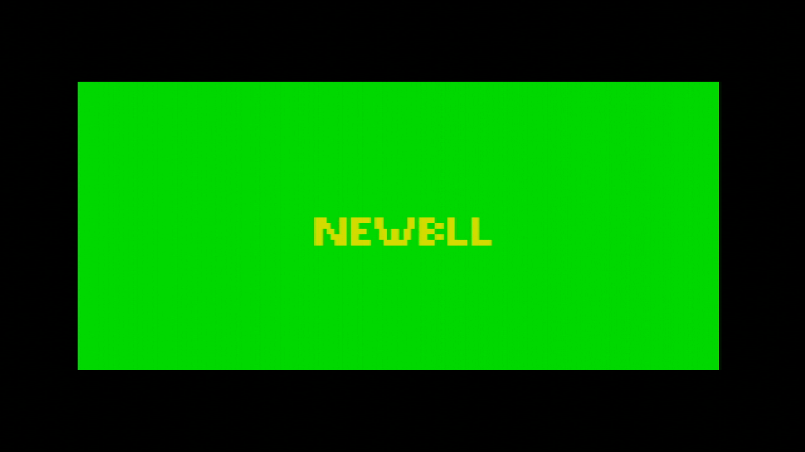

For quick cycling between your development machine and an actual Lynx you probably want to get your code to run on the Lynx as quickly as possible. The route of writing to a Flashcard or using a cartridge programmer requires a number of manual steps and is both slow and repetitive.

By running a Lynx program with uploader support you can send BLL files from your development machine to the Lynx over ComLynx without having to handle physical cartridges. It requires a cartridge that has a BLL or cc65 based uploader included in the Lynx game or program, acting as the host in the Lynx to receive your code. You can use your own games if they have support, or one the existing game cartridges with support, such as S.I.M.I.S. or Championship Rally. One downside to using the support from an host program is that the uploader will be located somewhere in memory. This is a potential problem for larger binaries, as it might overwrite the uploader routine.

Fortunately, there is an alternative in a dedicated solution for exactly the purpose of uploading to a Lynx. The `new_bll` toolkit contains a special Atari Lynx program to receive a BLL object file as bytes over a serial ComLynx connection. It is called `uBLL` and has a two-stage boot process, which runs the uploader program and waits until it begins receiving the bytes of the BLL object file over ComLynx.

Image with
Laptop -> ComLynx cable -> Lynx with uBLL

The loader is called `uBLL` and can receive uploads at a rate of 62500 or 1000000 baud (1MBd). The file `new_bll.lnx` contains a 256kB cartridge image with `LNX` header and is located in the `new_bll` Git repository in the `uBLL` folder.

> ### Fun fact
>
> The 'u' in `uBLL` represents the Greek letter µ ('mu') for `micro`. The actual microloader is only 205 bytes in size.
{: .block-tip }

'uBLL' is intended to be written to either a programmable cartridge or flashcard. After inserting a cartridge into the Lynx you can start it. You should see a green background indicating the default baud rate of 1MBd.

{:width="400px"}

When you hold any joystick button (directional or one of the fire buttons) when switching on the Lynx, the baudrate will be 62500 and the background will be black instead of green.

{:width="400px"}

## Uploading a BLL file

The next step after starting the microloader on the Lynx is to upload the BLL object file. You can refer back to the chapter on uploading files to check the details of the uploading process. In short, you will need to send the appropriate magic bytes `0x81` and `0x50` ('`P`' for Program), followed by the start address and XORed length of the array bytes that will follow.

There are several scripts and tools available to make it easier to upload the BLL file. The repository for `new_bll` has both a nodeJS and a Python version available. Here is an example in Python to initiate the upload of a file called `loderunner.o`.

``` bash
# Assuming current directory is root of cloned new_bll repository
cd sendobj.py
python sendobj -p /dev/ttyUSB0 -b 62500 loderunner.o
```

This should start the upload of the `loderunner.o` file and shows progress by quickly flashing lines in the background.

{:width="400px"}

The screen might start to appear corrupted after uploading for a longer period. This is as intended, as the memory area where the upload will be stored overlaps with video memory. The uploader itself is located in lower memory at `0x0100` and has a size of 205 bytes, so the uploader can use almost all memory available, typically starting at `0x0200` for most BLL files.

{:width="400px"}

The `uBLL` uploader will jump to the start address after the upload has completed. The execution of the BLL object file will start there.

> ### Important
>
> A BLL program must be running completely from memory and cannot have a directory structure or read additional files from the cartridge (other than what is on the currently inserted cartridge).  
{: .block-warning }

You can see the upload process in action in this video capture of the Atari Lynx:
<iframe width="560" height="315" src="https://www.youtube.com/embed/ntYuvAZTyTo?si=s828fEi4ETnRC4IV" title="Atari Lynx videos" frameborder="0" allowfullscreen></iframe>

## Implementation details of uBLL

The `uBLL` uploader consists of two stages as is typical for a cartridge based program. The first stage is encrypted, so the Mikey boot ROM can decrypt it correctly and execute the decrypted bytes at the target location.
Normally a single stage might suffice as the upload logic could be encrypted and run from the first stage, probably using more than a single encrypted block. `uBLL` intends to keep as much memory available for the binary to upload, it needs to place the actual logic somewhere else. In contrast, the cc65 uploader routine is located just before video memory. This approach will not allow a binary to be uploaded in that area, because it would overwrite the upload interrupt handler routine for receiving and storing the bytes. Another reason for two stages in `uBLL` is to keep the decryption process as short as possible by using just a single block of 51 bytes for the first stage.

Let's take a look at this first stage of `uBLL`. The important part is listed here ([full source](https://github.com/42Bastian/new_bll/blob/master/uBLL/bll_1st_stage.asm)):

```6502
  run $200

Start::
  ldy RCART0
  ldx #$ff
  txs

.read2nd:
  inx
  lda RCART0
  sta $100,x
  dey
  bne .read2nd

  jmp $100
End:
```

The start address is set to run at `$0200`, which corresponds to the load address and jump point of the decryption process in Mikey's boot routine. The first stage reads the first byte from the current location of the cartridge. That is the place where the Mikey ROM routine has finished reading the first encrypted block. The single byte read first indicates the length of the second stage. The stack pointer is properly initialized to the value `$ff` at the top to grow down. The X register is used as an offset to write all next bytes into the memory area starting at `$0100`. The Y register is decremented after reading each byte from the cartridge, essentially counting down the number of bytes to read. The loop logic checks whether `Y` is still non-zero and loop for a new iteration if not. Otherwise all bytes have been read and execution continues at `$0100` where the new bytes of the second stage were stored a moment ago.

The second stage starts of with the single byte for the length of the second stage itself. The size is calculated at the end of the second stage ([full source](https://github.com/42Bastian/new_bll/blob/master/uBLL/bll_2nd_stage.asm)):

```6502
  run  $100-1

Start::
  dc.b size    ; needed for 1st stage

;; Rest of stage 2

  End:
size   set End-Start

       echo "Size:%dsize "
```

The runnable code should be at `$0100`, so `run $100-1` accounts for the first size byte being before the actual start address. After the size byte there are two loops for initialization: one for Suzy and one for Mikey. The one for Suzy is listed below.

```6502
  ldx  #12-1
.sloop
  ldy  SUZY_addr,x
  lda  SUZY_data,x
  sta  $fc00,y
  dex
  bpl .sloop
```

The initialization for Mikey is similar. The loops take data from the end of the second stage in structures like these:

```6502
MIKEY_addr
  dc.b  $10,$11,$8c,_CPUSLEEP,_SDONEACK,$b3,$a0
MIKEY_data
  dc.b  125000/Baudrate-1,%11000,%11101,0,0,$0f,0
SUZY_addr
  db _SPRGO,_SCBNEXT+1,_SCBNEXT,$09,$08,$04,$06,$28,$2a,$83,$92,$90
SUZY_data
  db 1,>plot_SCB,<plot_SCB,$20,$00,$00,$00,$7f,$7f,$f3,$00
plot_SCB:
next:
  db $01  ;0
  dc.b SPRCTL1_LITERAL| SPRCTL1_DEPTH_SIZE_RELOAD ;1
```

The `SUZY_addr` and `MIKEY_addr` are offsets from `$FC00` and `$FD00` respectively. `SUZY_data` and `MIKEY_data` hold their corresponding values. As you may notice, the data for Suzy seems to be missing one byte. However, this byte is taken from the first byte of the `plot_SCB` data. This saves a single byte, a micro-optimization for a microloader.

|Address|Value|Description|
|---|---|---|
|SUZYBUSEN|1|Suzy bus enabled|
|SPRSYS|0|No special settings for sprite engine|
|SPRINIT|`$f3`|Must be set to this value according to docs|
|VSIZOFFL|`$7f`|Magic byte for vertical size offset|
|HSIZOFFL|`$7f`|Magic byte for horizontal size offset|
|VOFFL|0|No vertical screen offset|
|HOFFL|0|No horizontal screen offset|
|VIDBASL|`$00`|Video base address at `$2000`|
|VIDBASH|`$20`||
|SPRNEXTL|`<plot_SCB`|Low byte of NEWBLL sprite data|
|SPRNEXTH|`>plot_SCB`|High byte of NEWBLL sprite data|
|SPRGO|1|Start Suzy rendering engine|
|GREEN0|0|No green|
|BLUERED3|$0f|All red, no blue|
|SDONEACK|0|Suzy done acknowledge|
|CPUSLEEP|0|Reset CPU bus request flip flop|
|SERCTL|%11101|PAREVEN TXOPEN RESETERR PAREN|
|TIM4CTLA|%11000|ENABLE_RELOAD+ENABLE_COUNT|
|BAUDBKUP|125000/Baudrate-1|62500 baud rate from timer 4|

After the initialization there is a small piece of logic to switch between the default of 1MBd baud rate for `uBLL` or 62500 when a fire button, option button or direction on the pad is pressed.

```6502
  lda  $fcb0
  bne  .noturbo
  dec  $fda0
  lda  #%00010000
  sta  $FD9C      ; MTEST0: UARTturbo
.noturbo
```

The `$FCB0` register for `JOYSTICK` is read to check for a non-zero value indicating the pressing of a button or directional pad. Normally, this is not the case and the branch is not taken. This will decrease the zero value of `GREEN0`, which is the green part of color 0 in the palette. This decrement will set `GREEN0` to `$ff` and will change the background of the screen to bright green as a visual indication that the uploader is using the 1MBd baudrate for uploading. Also, it sets bit 4 of `MTEST0` located at `$fc9c` to `1`, which turns on the `UARTturbo` mode. This special mode for serial does not use interrupt from timer 4, but does the fastest possible, direct reading and writing of bytes to `SERDAT` at `$fd8d`.

If no joystick function was used, the logic for setting `UARTturbo` and the green color is skipped, reverting back to a normal use of the baudrate generating timer 4 and leaving the screen background at black.

The rest of the implementation is similar to the normal uploader also found in BLL and cc65. There is one significant difference though. The `JSR` to receive a byte over ComLynx in the serial port turned out to be too slow for the high baud rate. The microloader implementation does not use a subroutine to reuse the receive logic. Instead, a macro `READ_BYTE` is used, introducing code duplication to avoid the overhead of jumping and returning from subroutines.

```6520
  MACRO READ_BYTE
.\w
  bit $fd8c
  bvc .\w
  lda $fd8d
  ENDM
```

You can see the first use of the macro directly after initialization where the program waits to receive the command bytes `$81` and `$50` ('P') to continue with the rest of the upload.

```6502
wait:
  READ_BYTE
  cmp  #0x81
  bne  wait
  READ_BYTE
  cmp  #'P'
  bne  wait
```

This implementation proves to be fast enough to read at 1MBd. That is a 16 times speed improvement over the maximum baud rate of 62500 baud using Mikey's timer 4. Uploading to your Lynx is near instantaneous now.
You can refer to the chapter about BLL uploading, if you want to learn more on the way uploading works and how you can send data from your development machine to the Lynx.
