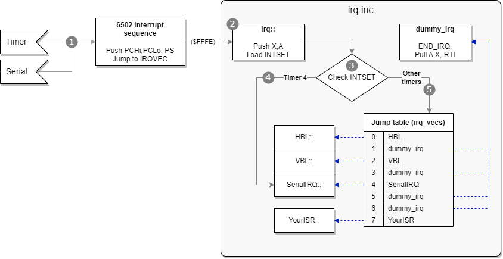

A common technique for handling interrupts in 6502 and related processors is to have centralized logic that takes care of determining with routine should handle a particular interrupt. This central logic is executed whenever an interrupt occurs and the `IRQVEC` interrupt vector of the processor is used to jump to it.

The central logic often uses a table with addresses corresponding to the various handlers per interrupt source. The interrupts in the Lynx are numbered from 0 to 7, and are always timer or serial related, so it would suffice to have 8 methods. Another approach is to have a list of methods that will execute regardless of the interrupt firing.

BLL takes the first approach and has an interrupt jump table with entries for each of the interrupts in the Lynx.



Figure X shows the flow for the BLL interrupt handling implementation. It consists of a number of steps to go from the interrupt occuring to a central Interrupt Service Routine (ISR) that dispatches to the appropriate registered handlers for an interrupt source.

1. After either any timer or the serial data line triggers an interrupt, the 6502 processor initiates the usual interrupt sequence and stores the high and low part of the program counter `PC` and the processor status `PS` onto the stack. The processor uses the `IRQVEC` interrupt vector to jump to the address of the ISR, which BLL has set to the `irq::` function. The BLL ISR is a dispatcher that will route the handling to the handler of the interrupt source with the lowest interrupt bit in `INTSET`.
1. The `irq` ISR function will push `X` and `A` onto the stack. It does not store `Y`, so this is a responsibility of the interrupt handler.
1. The ISR loads the value of hardware register `INTSET` at `$FD81` to retrieve the interrupt bits and will inspect the bits.
1. If the fourth bit `$10` for the serial interrupt was set, it will immediately jump to the registered handler for interrupt 4, which is for serial data. This will essentially prioritize serial over other timer interrupts.
1. For the other timers it will loop over the interrupt bits from 0 to 7 to find the first bit set. That bit indicates the index to an address stored in a table of interrupt handlers. The interrupt bit is cleared using `INTRST` and the address from the table is used to perform a `JMP` to that particular handler. The handler runs through its implementation and returns to normal execution by pulling the accumulator `A` and `X` register from the stack. Finally, it ends the ISR by calling `RTI`, which will restore the processor status from before the interrupt and continue the program at the original `PC`.

The implementation in BLL assumes that there will most likely be a single interrupt occurring at a time. It will handle the lowest interrupt source and return. It is efficient in most cases, because it will shortcut the loop across all 8 interrupt bits as soon as the first bit is encountered. If two interrupts happen at the same time, only one bit is going to be cleared. This causes a trigger of another interrupt after `RTI`, since there is still at least one interrupt bit high. It is a design choice and optimization, where cc65 chooses to evaluate all bits and call all relevant ISRs during a single interrupt sequence.

## Including interrupt support using BLL

The BLL library has all facilities to easily implement one or more interrupt handlers in your lyxass assembled code. It involves these steps:

1. Allocate memory for a jump table
1. Initialize table entries to meaningful defaults
1. Install your handlers for specific interrupts

Your BLL program will need three files for macros, variables and implementation to include interrupt support.

```6502
; Initialization of your program
include <macros/irq.mac>
include <vardefs/irq.var>

; 1. Allocate memory
; 2. Initialize IRQs
; 3. Install handlers

; Rest of your program

; Includes of library functions
include <includes/irq.inc>
```

The include of `irq.var` is only necessary when also using the debug features of BLL. It is okay to include, as it will not allocate any memory unless BRK support is included. You can refer to the chapter on BLL debugging to learn more about it.

## IRQ Jump table

Before the start of your code you have to allocate memory for the IRQ jump table that the BLL library functions for interrupt handlers expect and initialize it with safe defaults.

```6502
BEGIN_MEM
; Define array to hold 8 (double-byte) address entries
irq_vectors     ds 16
END_MEM

Start::
;
    INITIRQ irq_vectors
```

The call to the `INITIRQ` macro requires an argument representing the name of the variable for the 16-byte array of jump values. These 16 bytes represent 8*2 jump addresses, and are referred to as `irq_vecs` in the BLL library, as a synonym for your allocated memory.
When you use `INITIRQ`, it will expand to the following with the `irq_vectors` argument:

```6502
    irq_vecs    equ irq_vectors
    jsr InitIRQ
```

The routine `InitIRQ` will initialize the jump table to point to a dummy interrupt handler called `dummy_irq`. The implementation for this handler simply returns without doing any actual work besides the required cleanup.

```6502
dummy_irq
    END_IRQ
```

The BLL ISR logic will start by pushing `X` and `A` to the stack so it can be restored before returning from the ISR. Next, it loads the values of the interrupt bits from hardware register `INTSET` at `$FD81` into the accumulator.

```6502
irq::
    phx
    pha
    ldx #0
    lda $fd81
    bit #$10    ; SERIAL IRQ
    beq .1
    jmp (irq_vecs+8)    ; Jump to SerialIRQ routine

.loop
    inx
    inx
.1
    lsr
    bcc .loop

    lda mask,x
    sta INTRST
    jmp (irq_vecs,x)

; Break implementation (only when debugging is included)

mask
    dc.w $01,$02,$04,$08,$10,$20,$40,$80
```

BLL evaluates a potential serial interrupt separately from the rest of the interrupts. The ISR logic check for the presence of the 4th bit (`#$10`) in the accumulator holding the value of `INTSET`. If present, it shortcuts the rest of the logic by immediately jumping to the interrupt handler at the 4th position in the jump table (which has the address of the serial IRQ handler). This gives the serial interrupt the highest priority over the others. Typically, BLL registers the `SerialIRQ` handler if you included serial support.

If the serial interrupt bit is not present, it loops through the `INTSET` value looking for the first bit that is set, right to left, which means timer 0 to 7. It shifts the value to the right and checks if the bit has been pushed into the carry flag. If so, the particular interrupt bit was set. It is reset by using the `mask` value at that position. The mask holds the exact bit required to reset the IRQ flag. It is written to the IRQ reset handware register `INTRST` located at `$FD80`. The last action is to jump to the IRQ handler routine found at the current `X` offset in the jump table.

The handler logic loops and increments the `X` register twice in case the bit of the interrupt was not set. This effectively moves the offset inside the jump table one position further along. The final action of the ISR uses a `JMP` to jump to the indirect addressing for the `X` offset. The fact that it is a `JMP` and not a `JSR` is relevant for the actual interrupt handler. It implies that the handler is responsible for returning from the ISR and must do all required steps to properly finish, such as stack management and calling `RTI`.

## Interrupt handler routines

An interrupt that is triggered can have a handler routine to react to the event causing the trigger. Typically, this will be interrupts from timer 0 and 2 for horizontal and vertical video blank interrupts, or timer 4 for serial input/output being available for reading or writing. An IRQ is not required to have a handler. The jump table is initialized by `INITIRQ` to have all entries point to `dummy_irq`, which simply returns from the BLL ISR with `END_IRQ`. The interrupt base infrastructure will take care of clearing the interrupt flags in `INTRST` regardless of whether they have been handled by a real handler or not.

A handler routine should follow a certain structure. It must always end with an `RTI` (**R**eturn **F**rom **I**nterrupt) instruction to return from the interrupt sequence. As shown above the BLL ISR will push `X` and `A` to the stack, so you should make sure these are removed to avoid unwanted growth of the stack. You can pop the values of `A` and `X` from the stack to clean it up and either use or discard them. In BLL you can include the instructions for `PLA` and `PLX` yourself, or use the `END_IRQ` macro.

> ### Important
>
> Returning from an ISR should be done by using an `RTI` instruction, not `RTS`. The return address pushed onto the stack by each of these instructions is not the same. Make sure that your interrupt handler uses `RTI` or `END_IRQ` to avoid difficult to find bugs.
{: .block-warning}

Here is an example of a skeleton interrupt handler that could be used for a horizontal blank interrupt of timer 0:

```6502
; Interrupt handler routine
HBL::

    sty SaveY   ; Save value of Y register

; Your logic

    ldy SaveY   ; Restore value of Y register

  pla   ; Or replace these three calls with END_IRQ
  plx
  rti
```

Notice how the handler has been named `HBL::` to give it a global name.

Since neither the 6502 interrupt sequence nor the BLL ISR stores the `Y` register, you will need to store and restore `Y`` in your handler if you plan on keeping the original value from before the ISR. In most cases it is not necessary to do this and you can leave this out.

You can use the `END_IRQ` macro to replace the last three instructions of your handler. It will expand to the same instructions and make your code more compact.

## Installing IRQ handlers

There are two macros to help you with the handling of interrupts and preparing the interrupt jump table: `SETIRQ` and `SETIRQVEC`.

The macro `SETIRQVEC` is used to store the location of an interrupt handler routine for an IRQ associated with a particular timer. You are expected to use this macro before you have activated interrupts by calling `CLI` to clear the interrupt disable flag. The code from the `SETIRQVEC` macro is not guarded against interrupts while it is installing the vector in the jump table.

```6502
SETIRQVEC {IRQnumber},{handler_address}
```

where `IRQnumber` is a number between 0 and 7 for the timer and its IRQ, and `handler_address` is the label or hardcoded address of the handler routine, such as `HBL` in the example shown earlier.

```6502
SETIRQVEC 0,HBL
SETIRQVEC 2,VBL
SETIRQVEC 4,SerialIRQ
SETIRQVEC 7,timer7
```

Similarly, the `SETIRQ` macro also sets the interrupt handler, but in addition will enable the interrupt. It is safe to call whenever other interrupts are already active, as the macro will start with disabling interrupts using `SEI`.

```6502
    php
    sei

    ; Same as SETIRQVEC

if \0<>4
    lda #$80
    tsb $fd01+(\0)*4
endif
    plp
```

It uses the `TSB` instruction to set the 7th bit `ENABLE_INT` of timer control A to `1` which enables the interrupt for that particular timer. It uses the number of the interrupt times 4 to offset to the address of the correct timer's A control: from timer 0 `TIM0CTLA` at `$FD01` to the last timer 7 `TIM7CTLA` at `$FD1D`.

In your initialization code you can call `SETIRQ` similar to `SETIRQVEC` and connect the timer to your handler function.

```6502
    SETIRQ 2,VBL    ; set irq-vector and enable IRQ
    SETIRQ 0,HBL
```

There is a macro `RESIRQ` that disables a particular interrupt:

```6502
MACRO RESIRQ
    php
    sei
    if \0<>4
        lda #$80
        trb $fd01+(\0)*4
    endif
    plp
ENDM
```

It uses the `TRB` instruction (instead of `TSB`) to unset the 7th bit `ENABLE_INT` of timer control A to zero. This makes sure that after the call to `RESIRQ` the timer is not triggering interrupts.
