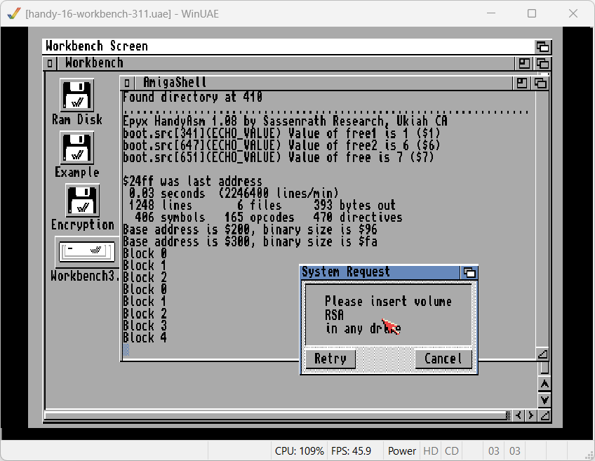

Both Handy development kits allowed developers to create binary ROM files from source code files. The best result a developer could achieve was a binary file respresenting the contents of a cartridge, with one important omission: it did not include a bootable header compatible with the boot and decryption process performed by the Mikey ROM boot code during startup. Instead there was a reserved space for the header with all zero bytes. Howard and Pinky were able to load and run these files, bypassing the loader and allowing the developer to test the ROM on real hardware. The ROM files themselves are not able to run on a regular Atari Lynx.

Once the ROM for the game was tested enough and ready for playtesting it would be sent to Atari for verification and encryption. Atari had additional Handy tools capable of obfuscating, encrypting, calculate checksums and assembling the boot loader to build the final ROM file. This ROM was written to an EPROM or EEPROM for beta testing on prototype cartridges. The tools were not included in the Lynx Development System, so Atari was the only one able to create the ROM files. In this way Atari always had control over cartridge creation, giving them opportunity to perform quality assurance, prevent unallowed 3rd party publishing of games. Moreover, it made potential piracy more difficult, as the encryption and checksums of the cartridge contents was good and obscure enough to thwart any attempts at manipulating ROM files.

Nowadays it is fairly trivial to create a Lynx cartridge with an encrypted boot loader without using the original Atari tools. The community reverse-engineered the creation of the loader. In addition, the  availability of the encryption keys and source code for the encryption tools gives us all needed knowledge of the process to create an "official" cartridge. Although we do not need the original tools anymore, they still  give us a lot of insights in the workings of the cartridge creation. Also, it allows us to recreate and relive the workflow of the Atari employees in the late '80s and early '90s.

## Cartridge creation process

The Atari process to create a cartridge involves three steps:

1. Develop and compile a ROM file
2. Create and encrypt a two-stage boot loader (specifically for this ROM file)
3. Build final cartridge file and transfer to EEPROM

The work for these steps was performed at two stages by different people using different tools. 

The first step and stage is done by the Lynx developers creating a Lynx program or game. They produce a ROM file with a missing boot loader and can test this using the Epyx development hardware of Howard/Howdy and Pinky/Mandy. 

The second and third were done exclusively by engineers at Atari, assuming no other companies had access to the encryption tooling. The ROM file was used by the encryption tools to build a unique boot loader with a checksum and embedded directory entries for the title screen and entry point file. The third step simply merged this boot loader with the ROM file, replacing the zeros with the newly created loader. After that the file was burned to an (E)EPROM and given a cartridge base for further testing.

Let's go through the entire process and also use a practical use case of building a program to make it more tangible. The Mandelbrot program from the Handy examples located in the `6502/examples` folder will serve as the practical case. The goal is to demonstrate building a 128KB rom file with encryption that is able to run the fractal calculation program on an Atari Lynx.

### Compile unencrypted ROM file

Developing a program or game for the Atari Lynx using Handy (Lynx Development System) is covered in other chapters. The Mandelbrot program only has a single source file called `mandel.src`. Obviously, the first step is to compile the source code to a binary object file.

```shell
asm mandel.src +R +H30000 +L +S
```

The source files references several include, macro and other source files from the `6502` directory. The resulting files are a binary object file `mandel.bin` with a listing file `mandel.lst` and symbols file `mandel.sym`. The symbol and list file help in analyzing and debugging the program, but are not needed downstream.

The `mandel.hsf` and `cartdefs.i` files contains information about the ROM file and the directory layout of files contained in the cartridge. They are not included in the original example code.

```shell
   .IN cartdefs.i

   FILE TITLE_FILE
   BIN title.bin

   FILE MAIN_FILE
   BIN mandel.bin
```

The first file holds the data for a title screen. It must contain a 32-byte set of colors and a SCB definition for a sprite or chain of sprites. The 32-byte color palette is copied directly into the registers from `GREEN0` at `$FDA0` to `BLUEREDF` at `$FDBF` filling the entire palette. The SCB information is loaded from the next bytes and used to display the boot screen. Typically the first sprite clears the entire screen and is chained with the rest of the sprites, or it is a single full screen sprite covering anything.

The Mandelbrot sample uses a simple title screen `title.bin` with a SCB for a single pixel stretched sprite to create a plain blue boot screen.

`cartdefs.i` defines details about the cartridge to create:

```shell
TITLE_FILE              .EQU  0
MAIN_FILE               .EQU  1

ROMDIR_PAGE             .EQU  0  ; This field is required
ROMDIR_OFFSET           .EQU  1  ; This field is required
ROMDIR_FLAG             .EQU  3
ROMDIR_DEST             .EQU  4
ROMDIR_SIZE             .EQU  6  ; This field is required
ROMDIR_ENTRY_SIZE       .EQU  8  ; This field is required

ROM_HEADER_SIZE         .EQ   410
ROMFILE_ALIGN           .EQU  1
ROMSIZE                 .EQU  $100*512  ; 128KB size ROM
; ROM_NODIR
ROM_SCREENBLANK_VALUE   .EQU  $FF ; Clear to white
ROMPAGECOUNT            .EQU  256

* -------------------------------------------------------------------------- xl
* These constants should not be edited.  You should allow their values to 
* be computed based on the values that you've entered above.  
ROMPAGESIZE          .EQU  ROMSIZE/ROMPAGECOUNT
ROMDIR_FILE0_PAGE    .EQU  ROM_HEADER_SIZE/ROMPAGESIZE
ROMDIR_FILE0_OFFSET  .EQU  ROM_HEADER_SIZE-{ROMDIR_FILE0_PAGE*ROMPAGESIZE}
ROMDIR_FILE1_LOC     .EQU  ROM_HEADER_SIZE+ROMDIR_ENTRY_SIZE
ROMDIR_FILE1_PAGE    .EQU  ROMDIR_FILE1_LOC/ROMPAGESIZE
ROMDIR_FILE1_OFFSET  .EQU  ROMDIR_FILE1_LOC-{ROMDIR_FILE0_PAGE*ROMPAGESIZE}
* --------------------------------------------------------------------------
```

The various aspects of the cartridge found in the cartridge definition `cartdefs.i` are as follows:

- Symbolic names (instead of numbers) for included files
- Layout and structure of a single directory entry
- **Header size for boot loader**
- Alignment of files to a byte boundary (as a power of 2 value)
- Flag to omit file system support code
- Color of blank screen during boot process
- Count for number of pages in ROM (256 regardless of ROM size).
- Rom size of cartridge

> ### Background
>
> An Atari Lynx cartridge has a fixed number of 256 pages. The different cartridge sizes of 128, 256 and 1024 kilobyte exist because a single page can have either 512, 1024 or 2048 bytes. 
> The `ROMSIZE` is declared as `$100` (256 decimal) pages with their respective page size.

The two mandatory directory entries are relevant and important for the cartridge creation process. It is required to provide both of these entries and their corresponding files as specified in the Handy development documentation. The boot loader includes these two entries in the source code as binary data. This guarantees that any manipulation to the file location of the title screen and main program entry point outside the encrypted boot loader would be without effect. The boot loader uses the copied information of the two entries found inside itself.

The `HandyROM` tool uses the `.hsf` file to create a binary file with the `.rom` extension that has a reserved space of required bytes (filled with zeros `0x00`) for the encrypted header. The header with the encrypted boot loader will be created in the next step and is going to replace the placeholder zeros.

```
Epyx HandyROM (BIG) A0.07 by Sassenrath Research, Ukiah CA
0.05 seconds, 128K ROM, 6102 bytes used, 124970 bytes free
```

### Two-stage boot loader

Atari used a boot loader that would complement the decryption by Mikey during booting with a checksum and de-obfuscation process. The checksum could detect any changes in the cartridges contents after the header. The header itself would not be decryptable if any change is made to it. The decryption process during the boot sequence is explained in the corresponding chapter in more detail.

All Atari boot loaders use two-stages:

1. **First stage**  
   Display title screen and start loading and running of second stage
2. **Second stage**  
   Perform checksum verification of cartridge content

The earlier versions of the boot loader were 512 bytes total and had two 5-block frames of 256 encrypted bytes each. Later versions only required 410 bytes bytes in a 3-block (154 bytes) and 5-block frame (256 bytes). The chapter on encryption covers blocks and frames more extensively 

The creation of the boot loader involves multiple steps and tools. The AmigaDOS script `doit` helps coordinate these steps using is executed from the shell window. It requires two arguments. One is the name of the ROM file and the other the size of the ROM to create. 

Since the `cartdefs.i` file specifies the romsize, it should use the same size here. The Mandelbrot sample targets a 128KB cartridge, so uses `128` as the second argument.

```shell
execute doit mandel.rom 128
```

The script performs a number of steps:

1. Checks whether the specified file exists
1. Checks that ROM size is either `128`, `256` or `512`
1. Creates file `romsize.i` containing an equate of for `ROMSIZE`:
   ```
   ROMSIZE	.EQ 128*1024
   ```
1. Runs `buildchk` to check the presence of two directory entries. It creates two  files (`romdir.i` and `checkstring.src`).
1. Compilation of the boot loader code in `boot.src` with references to the files created in the previous steps. The result will be two separate files `boot.bin` and `boot2.bin` for the two stages of the boot loading process.
1. Strips the first and last bytes of the boot code binaries. This results in raw binary files `boot.raw` and `boot2.raw`, without metadata of the load address and length for each binary file.
1. Obfuscates the raw binary files and writes these to `input1` and `input 2`.

## 

The output of the script at this stage in WinUAE might look similar to the following screenshot:



```
Found directory at 410
................................................................
Epyx HandyAsm 1.08 by Sassenrath Research, Ukiah CA
boot.src[341](ECHO_VALUE) Value of free1 is 1 ($1)
boot.src[647](ECHO_VALUE) Value of free2 is 6 ($6)
boot.src[651](ECHO_VALUE) Value of free is 7 ($7)

$24ff was last address
 0.05 seconds  (1497600 lines/min)
 1248 lines       6 files     393 bytes out
  406 symbols   165 opcodes   470 directives
Base address is $200, binary size is $96
Base address is $300, binary size is $fa
Block 0
Block 1
Block 2
Block 0
Block 1
Block 2
Block 3
Block 4

Now take the RSA disk to drive 0 of the encryption system
and perform the encryption.  When the encryption is done,
return the disk to this system and press return 
```

The output shows how `boot.src` is compiled after the creation of the files `romsize.i`, `romdir.i` and`checkstring.src`. It uses an older 1.08 version of HandyAsm.

```
asm boot +s
```

During compilation of the single `boot.src` file two compiled binaries are created `boot.bin` and `boot2.bin`, one for each of the two loader stages, as well as a symbol file `boot.sym` because the `+s` argument was supplied to the assembler. The binary object files are stripped by `asmstrip` into a raw binary file for both boot files, using the metadata included. These files are `boot.raw` and `boot2.raw` and will be contiguous blocks of bytes, filling up free space with zeros to form files of exactly 150 and 250 bytes.

The script continues with the `premod` tool. This tool will take a raw binary file and performs obfuscation on it using the algorithm described in the encryption chapter. The script does so for both raw boot files by running `premod` twice. Two new files `input1` and `input2` respectively are written. These contain the obfuscated content of the raw binaries.

The obfuscation algorithm works on blocks of exactly 50 bytes. Not quite surprisingly the two raw boot loader files are 150 and 250 each, both multiples of 50. With the padding of the blocks to 51 bytes using a `0x15` byte, you can tell that `input1` and `input2` are indeed obfuscated by the characteristic starting byte `0x15`.

```
15 75 24 47 9a 7f a3 68 08 89 5b ac 6c f5 a8 24
06 ce fc 67 97 8c ba ba 95 b0 b2 69 9f 03 e0 1a
66 a2 b4 fe 4f 72 fe 85 5f a3 20 e1 a1 62 b3 2f
20 80 80 15 65 42 5e 01 74 7e 66 ac 71 ff 89 5b
af ea 46 cd 5d 02 7f 7d 8d 87 2b 59 09 1f e2 00
c8 14 24 ff 57 aa fd ba fd 53 29 e8 c4 24 63 13
93 e7 88 8b 5d 07 15 a0 42 7e 10 ce ea 11 d3 29
29 d0 63 51 64 f7 65 5e c7 f2 1d 02 18 ff 0b 02
74 88 ff 77 01 71 fc 24 00 ff 01 fc e4 1f a1 69
27 06 42 53 a0 93 c1 88 b2
```

At this point the working folder contains a number of new files, that will be recreated every time the doit script runs. In order of creation these are:

- `romsize.i`
- `romdir.i`
- `checkstring.src`
- `boot.bin`
- `boot2.bin`
- `boot.sym`
- `boot.raw`
- `boot2.raw`
- `input1`
- `input2`

## Checksum for cartridge content

The tool `buildchk` checks for the required two directories entries, calculates a checksum for the contents of the cartridge and generates two source code files for the boot loader based on the results.

The two directory entries are presumed to be located after the boot loader at either 410, 512 or 0 bytes. The latter is probably for special header-less use cases. The values for the directory entries are used to generate a file `romdir.i` with a number of equates in 65C02 assembly that represent the directory entries 0 and 1. This file is included later by the boot loader source code.

```6502
FILE0PAGE      .EQ $00
FILE0OFFSET    .EQ $01aa
FILE0ADDRESS   .EQ $2400
FILE0SIZE      .EQ $0038

FILE1PAGE      .EQ $00
FILE1OFFSET    .EQ $01e2
FILE1ADDRESS   .EQ $630a
FILE1SIZE      .EQ $158e
```

If the entries are not found `buildchk` will stop  with a `10` exit code.

The next part involves calculating a checksum for the cartridge content. The entire content of the ROM file is read starting after the reserved space for the boot loader. An substitution box hashing algorithm is used to compute the 16 byte checksum. The substitution box is a set of 256 bytes that is initialized with a permutation of all values from 0 to 255. The box used for the Handy checksum is static and listed here for completeness, as taken from the `buildchk.c` source code.

```
int sbox[] = {
   0x42,0x47,0x8A,0x1B,0x01,0x53,0x68,0x1F,0x30,0x7A,0x14,0x84,0x05,0xFA,0xC6,0xAD,
   0xD8,0xFB,0xD2,0x0D,0x64,0x9D,0x93,0xF4,0x49,0x21,0x76,0xD5,0x6F,0xBB,0x9E,0xDC,
   0x92,0x8C,0x31,0x60,0x26,0xA8,0xC7,0x3E,0xB8,0x7E,0xCE,0xC1,0xDD,0x9B,0xF9,0xC2,
   0x97,0xF5,0xFC,0xBE,0xA9,0x3B,0x9C,0x6D,0xAA,0x10,0xE4,0x43,0xD1,0x5E,0x0E,0xB1,
   0xCB,0xC5,0xB3,0x94,0x44,0x4E,0xC8,0xF8,0xEC,0x5F,0xCA,0xE6,0x0F,0x8B,0x1C,0x4A,
   0x0C,0x06,0xE3,0x2F,0xE5,0x19,0x1A,0x2E,0x69,0x88,0xEF,0x0B,0x9A,0x46,0x55,0x3A,
   0x11,0x1D,0xA5,0xC0,0x87,0x48,0x29,0x17,0x8D,0x78,0xAB,0xEE,0x7D,0x54,0x08,0x1E,
   0xA0,0xED,0x6C,0x13,0xD9,0xB9,0x81,0xAE,0x95,0xA3,0x18,0xD7,0x66,0xBA,0x99,0xEA,
   0xD3,0xA7,0xF2,0xD6,0x04,0xA1,0xF3,0x5B,0x77,0x3D,0xA6,0x09,0xB4,0x86,0x6B,0x4F,
   0xDE,0x50,0x52,0x22,0x2B,0x16,0x57,0xDF,0x65,0x4D,0xE0,0xAF,0xCD,0x3C,0x90,0x72,
   0x5A,0xF0,0xE2,0x2A,0x8F,0xE9,0xFF,0x28,0xB6,0x89,0xB2,0xF1,0x9F,0x61,0x6A,0x12,
   0x80,0x98,0x37,0x67,0xFE,0xB7,0x41,0x45,0x2D,0x6E,0xCF,0x75,0x0A,0x25,0xE1,0x7F,
   0xAC,0x2C,0x82,0x7B,0x23,0x4C,0x4B,0x33,0x58,0x32,0xF7,0x35,0xEB,0x85,0xC4,0xBF,
   0x8E,0x5D,0x63,0x5C,0x39,0x3F,0xA4,0xE8,0xBD,0x36,0x00,0x71,0xF6,0x51,0x20,0xCC,
   0x27,0xB0,0xD0,0xDA,0x96,0x74,0xBC,0x24,0xB5,0xE7,0x02,0x91,0xC9,0x07,0x59,0x79,
   0xC3,0xA2,0x83,0x15,0x40,0x56,0x34,0x03,0xDB,0xD4,0x62,0xFD,0x73,0x70,0x7C,0x38
};
```

The value of the calculated checksum is written to the file `checkstring.src` as a 16-byte hexadecimal representation for binary data in 65C02 assembly.

```
.HS 5ec3ba1e6fd2a2cbf4c7d8c290a01e60
```

The code for the boot loader will include `checkstring.src` later on. 

```6502
BUFFERLENGTH   .EQ 32               ; 256 bits
RESULTLENGTH   .EQ BUFFERLENGTH/2   ; 128 bits

checkstring
   .IN checkstring.src ; Must be exactly RESULTLENGTH bytes long
```

As explained in more detail in the chapter on the boot process, this checksum is recalculated and compared with the stored value inside the boot loader of the cartridge. If it does not match the characteric `INSERT GAME` message is shown and further booting is halted.

Insert the empty disk `empty.adf` into floppy drive `df0:`. It should have the `RSA` label. If not, make sure to rename the diskette Workbench.

input1 -> RSA disk -> output1

`cartdefs.i` file

```6502
file01dir
   .BY FILE0PAGE
   .WO FILE0OFFSET,FILE0ADDRESS,FILE0SIZE

   .BY FILE1PAGE
   .WO FILE1OFFSET,FILE1ADDRESS,FILE1SIZE
```