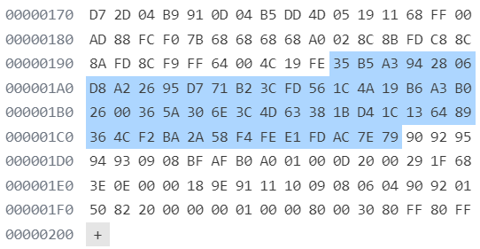
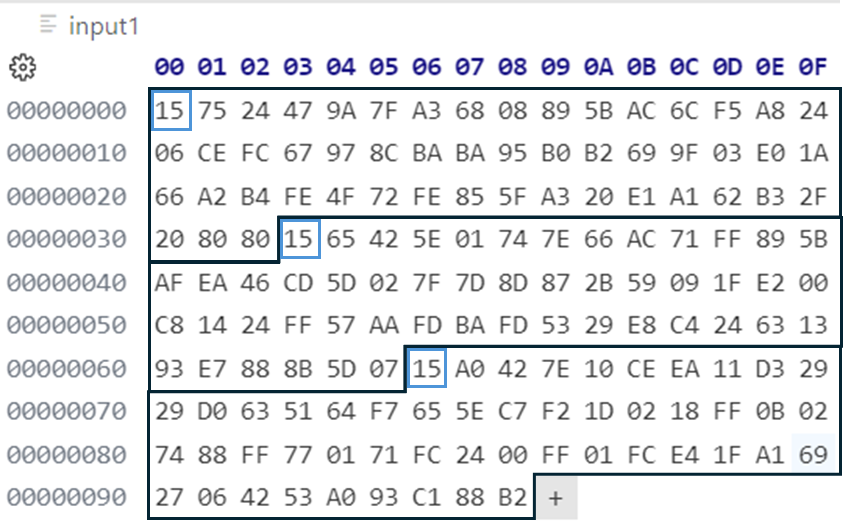

Atari used an advanced system for the encryption of cartridge headers. The entire process for the creation of a bootable cartridge header is covered in another chapter. This chapter focuses on the actual encryption of a header. The boot header for the Atari Lynx needed to be encrypted in similar fashion as the decryption performed by the Atari Lynx at startup. It is the reverse of the decryption process. The purpose of the encryption is to make the header both unreadable, unchangeable and non-reproducible.

The total encryption algorithm involved two steps:

1. Obfuscation
1. Encryption

The obfuscation scrambles the header around, so it becomes less obvious to see or analyze what the actual data is. It is an additional hurdle to take when a header might get decrypted. It would not be obvious that the data was correctly decrypted, because the decrypted data does not look like 65C02 assembly yet.

The encryption itself is performed by using the RSA algorithm, which uses a set of three very large prime numbers that is nearly impossible to guess or reconstruct. Only when the exact keys are used can data be encrypted and later decrypted, provided that the same key set are used for each. This implies that it is very important to keep the keys safe.

For all that it matters an cartridge header for the Atari Lynx is simply a number of bytes containing code and data that the 65C02 can execute and use. From here on in these bytes are referred to as the unencrypted (header) data.

## Obfuscation

The purpose of the obfuscation step is to prevent the decryption of the header to return the original code that is immediately executable or readable. Only after both decryption and de-obfuscation do the bytes become code and data that can be run on the processor. Therefore, the obfuscation performed when creating the header should be reversible. The de-obfuscation algorithm must be simple enough to allow it to be performed on the Atari Lynx with its small 64KB memory and limited compute power of the 65C02. Both the obfuscate and de-obfuscate algorithms are very similar in the way they work, so the obfuscation has the same complexity (or lack of it) as the de-obfuscation.

The obfuscation algorithm takes bytes from an array of arbitrary length. It subtracts the value of a byte at any position in the array from the next. The first byte is always unaltered. The result of this obfuscation is stored in reversed order before being encrypted.

The original routine was implemented in C as follows:

```c
int i, j, checksum=0;
unsigned char array[50];

for (i=49; i>=0; i--) {
    if ( (j = getc(fpin)) < 0) { 
        printf ("Error reading input file: %s\n", argv[1]);
        exit (1);
        }
    array[i] = j-checksum;
    checksum = j;
    }
```

Notice how it is running from the end to the start of the array, avoiding having to store the original value of a byte before being overwritten.

As an example, take an array of bytes from an unencrypted header:

```data
0x80, 0x00, 0x20, 0x4f, 0x02, 0x64, 0x05, 0xe6, ...
```

Reading right to left, the algorithm would subtract `0x05` from `0xe6` to `0xe1`, and `0x64` from `0x05` wrapping to `0xa1`, and so on. After performing all subtractions and reversing the order this will become an array ending in these numbers:

```data
..., 0xe1, 0xa1, 0x62, 0xb3, 0x2f, 0x20, 0x80, 0x80
```

As the length of the array is not relevant for the algorithm it is possible to choose any convenient size of data to work on. The code for obfuscation shows that the size is a fixed `50` bytes. The reason will become evident in a moment.

## RSA Encryption

The encryption step involves actual RSA encryption. At the time this was a very advanced and strong encryption mechanism, even though the chosen key length might not be considered secure in present days. It was more than good enough in the '90s to protect the header of Atari Lynx cartridges from tampering or inspection.

> ### Interesting fact
> By comparison the Sega Game Gear and Nintendo Gameboy cartridges only had a specific layout in their header without any encryption. The layout was not fixed and any checks performed were done on plain bytes. Anyone was able to both read and change values in the cartridge and also header.

RSA encryption is an asymmetric encryption algorithm. The algorithm is applied to data that needs protecting. Once encrypted the data cannot be read anymore and decryption is only possible when in possession of the correct key.

RSA uses a public and private key, each consisting of an exponent and modulus. The exponents are also public and private, whereas the modulus is shared and the same in both keys. All numbers involved are prime numbers and are taken to be of a certain length when expressed as individual bytes. Typical modern day key lengths are 2048 to 4096 bits. The larger the number of bits in the keys the more compute power is required to calculate the encrypted version of data or the decryption afterwards. The Atari Lynx used a key length of 416 bits (which is 52 bytes).

The public and private keys are so named for a reason. The public key can be freely shared to anyone, but the private key must always be safeguarded and protected from being exposed. Only the owner should be in posession of the private key.

The asymmetric nature of the algorithm give two types of application to data:

1. **Encryption by anyone, decryption by owner**  
   Allows safe exchange of sensitive data to a known owner. The data is encrypted with the public key and send to the owner of the private key. Only the owner can decrypt the data and see its original content.
1. **Encryption by owner, decryption by anyone**  
   The data is encrypted by the owner of the private key. It is transmitted to a recipient, who can decrypt it with the public key. The data is not so much safe, as anyone can decrypt it, but free from any tampering and known to have been encrypted by a known user.

The second application is the basis for the use case of the Lynx header and cartridge protection. The header is encrypted by Atari, who are the owners of the private key. That allowed Atari to encrypt and thereby protect the header from tampering and make inspection more difficult. This implies that the public key (the public exponent and accompanying modulus) were shared to the outside world, because the Mikey ROM had it embedded. This is certainly not a problem, as the public key is intended to be used this way and shared.

## Primer on RSA mathemetics

The calculations in RSA are small and simple, yet complex to perform, as they involve very large numbers. The RSA algorithm works with exponents and a modulus of large prime numbers. The plain or encrypted data is also considered a large number (but not necessarily a prime).

The encryption of unecrypted data in the form of a number `plain` performed using a private key `privatekey` and modulus `modulus` is performed as follows:

$encrypted = plain^{privatekey} \mod modulus$

The block must be raised to the power of the private key and modulo divided by the modulus.

Consider the following public/private keypair with only a 8 bit key length:

```
Public key:
- Modulus: 49619
- Exponent: 17

Private key:
- Modulus: 49619
- Exponent: 4660
```

Let's encrypt the following "data" of 25632.

$ encrypted = 25632^{4660} \mod 49619 = 31804 $

## Montgomery multiplication

The value of $25632^{4660}$ is extermely large with **20545** digits to represent it as a decimal integer, or **5619** bytes. It will not even fit properly onto two pages of this book. The number of bits required for the maximum achievable size would be around 131 thousand bytes for a 16 bit key length. Imagine what a 2048 bit long key would render as intermediate results.

The decryption of data is similar to encrypting it. This time the public key is used in the power, so it is:

$plain = encrypt^{publickey} \mod modulus$

Both formulas use a modulo division where only the remainder after division is taken. It implies that the result can never be larger than the length of the modulus and consequently the public and private key pair as all lengths are the same. Hence, RSA encryption can only encrypt blocks of data that are less than the key length being used. Larger data needs to be divided into separate block that are within the allowed length.

## Atari Lynx encryption keys

The Lynx encryption keys were chosen to be 51 bytes long each. This was within the practical limits of calculations and also for practical purposes that will become evident shortly. In effect, the Lynx encryption keys can be used to encrypt binary data of at most 50 bytes, one byte less than the modulus as discussed above.

The public keypair consists of the modulus and the public exponent. It is common to choose one of the prime numbers  `3`, `5`, `17` or `63367`. The reason is that public keys are exposed, as well as the modulus. Since the decryption raises the encrypted to the power of the public key, it might as well be a small prime number to make the calculations easier and faster. Atari chose the number `3`.

The modulus, which is part of both the public and private key, is available both to Atari and to everyone with an Atari Lynx. The console needs to know the modulus to be able to perform decryption. The next prime number is the modulus accompanying the `3` public exponent.
```
35B5A3942806D8A22695D771B23CFD561C4A19B6A3B02600365A306E3C4D63381BD41C136489364CF2BA2A58F4FEE1FDAC7E79
```

The bytes for the modulus are inside Mikey's ROM at the offset of `0x19a` to `0x1cc` from the start of the ROM at `$FE00`. 



This puts the modulus at `$FF9A` to `$FFCC` as absolute address.

## Private key

Atari meant to keep the private exponent secret. Atari also devised a way to not have a single file containing the key, as it would be too easy to loose track of the one file or any media containing it.

Originally Atari had three separate encryption disks containing one "keyfile" each, `keyfile.1`, `keyfile.2` and `keyfile.3`. None of these files contained the private exponent by itself. Only when the three keyfiles are combined can the private exponent be generated. Each keyfile was already 51 byte long, so there was more involved than simply adding three part together sequentially.

During the encryption process the private key would be built in-memory by loading all three disks consequtively. The keyfiles contain the hexadecimal representations of a 51-byte long array of bytes. Here are the contents of each of the three files:

```cmd
Keyfile 1:
ea6cadb2abb1d3ee856fd336c0c1161d3144651a2281b5b826ddce0f8fbb25c81d34031fb4b9aedacfde75c1d2ed354bcc1158
Keyfile 2:
14d63008355728ef2ba325b7118c622d167a7dee57e73718c996e5a963496815f66c128c9eebdaefbd753a9e7d02e6e9fdd797
Keyfile 3:
dd74f0b7eee26b6db775ccca1d65dcd435e209d018469bf596cc80fa44eaee0e23bb36fe6822bfb5537df2fb86829413d4246c
```

The three keys need to be `XOR`'ed together to make the final private encryption key.

```
keyfile1 ^ keyfile2 ^ keyfile3 = 
23ce6d0d7004906c19b93a4bcc28a8e412dc11246d2019557987ab5ca818a3d3c8e3276d4270cb8021d6bda4296d47b1e5e2a3
```

The complete RSA encryption public/private keypair is composed of the public and private exponents and the modulus.  

```cmd
private key: 
23ce6d0d7004906c19b93a4bcc28a8e412dc11246d2019557987ab5ca818a3d3c8e3276d4270cb8021d6bda4296d47b1e5e2a3
public key:
000000000000000000000000000000000000000000000000000000000000000000000000000000000000000000000000000003
modulus:
35b5a3942806d8a22695d771b23cfd561c4a19b6a3b02600365a306e3c4d63381bd41c136489364cf2ba2a58f4fee1fdac7e79
```

> ### Fact
>
> This public exponent prime number `3` will not be found anywhere, but implicitly as a double multiplication during the decryption process:  
> $block^3 = block*block*block$
```

```shell
xxd -r -p private_key.txt private_key.bin
```

## Performing encryption and decryption

The RSA formulas for encryption and decryption have a similar shape.

$
encrypted = plain^{privatekey} \mod modulus \\
plain = encrypt^{publickey} \mod modulus
$

Both of these have a power and a modulo division. In modern programming languages it is fairly trivial to perform the RSA calculations, as there are many libraries available for exactly this formula. 

For example, in .NET the `System.Numerics` namespace offers the `BigInteger` class that can do this exact calculation with the static `ModPow` method. The following piece of C# code demonstrates the use.

```c#
using System.Numerics;
BigInteger data = new BigInteger(block);
BigInteger plain = BigInteger.ModPow(data, privateExponent, modulus);
```

It assumes that `privateExponent` and `modulus` are two variables of type `BigInteger` that have been populated with the respective byte arrays of the private exponent and modulus for the private key.

The data is usually an array of bytes that is considered to be the elements of a very large integer value.

As an example, take an 4 byte array. 
```
bytes: 0x17, 0xa2, 0x56, 0xdc
integer value:  396515036 (BigEndian)
integer value: 3696665111 (LittleEndian)
```

This introduces the concept of 


> ### Important
>
> The order of the bytes in the array representing the public and private key as well as the modulus is dependent on the endianness of the system used. The keyfiles contain the values in the correct order for a big-endian system such as PowerPC and 68000 based computers.  
> For little-endian machines such as x86, x64 and ARM processors, the arrays of bytes for the keys and modulus need to be reversed. The unencrypted and encrypted data are normal arrays of the data blocks.
>
> ```cmd
> Big-endian: 23 ce 6d 0d ... b1 e5 e2 a3
> Little-endian: a3 e2 e5 b1 ... 0d 6d ce 23
> ```
>
> This is on a byte by byte basis where the order of the bits inside a byte are unaffected.

## Blocks and frames

The obfuscation algorithm works on blocks of data of exactly 50 bytes. Not quite surprisingly the two raw boot loader files are 150 and 250 each, both multiples of 50.

Since the blocks are only 50 bytes long and the encryption requires numbers of 51 bytes a non-zero byte `0x15` is added at the beginning of the byte array representation for the large integer (meaning the least significant byte of the number). So, you can recognize an obfuscated binary by its first byte, which will always be `0x15`.

{ width=50% }

> ### Important
>
> As with the encryption keys it is good to remember that the Amiga and its 68000 processor is BigEndian, so numbers are in the reversed byte order when compared with LittleEndian numbers.
> Secondly, the obfuscation prepares blocks of 51 bytes that can be considered as large integer numbers for the RSA encryption. Since the encryption key is 52 bytes it can encrypt and decrypt numbers of exactly that many bytes.

