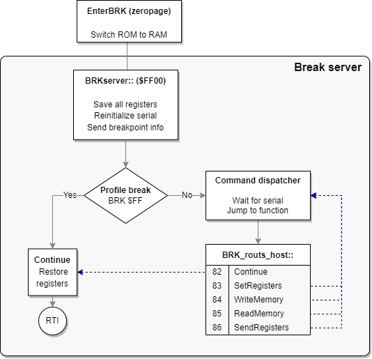
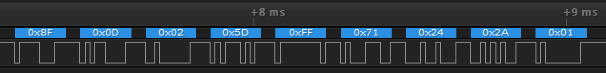

While you are developing programs and games for the Lynx, you sometimes want to debug your code and the flow of execution to find bugs or improve your code. You can usually do most of the debugging with the existing emulators. Handy and Felix have debugging support built in that will help you debug during emulation. They allow immediate entering break mode upon request, inspection of memory to check both RAM and hardware registers, disassembly the code that is currently loaded and even change code and data. In some situations you might find that it is necessary to debug your Lynx code on the actual console. This is less trivial, as a regular Lynx console was never designed for debugging. Still, there are ways that a normal Lynx console can be used to debug your code.

The debugging of Lynx programs on physical hardware requires serial communication between the console and a development machine acting as a host. The Lynx will be the debuggee (program being debugged) and the host runs a debugger program that you operate remote from the Lynx. The communication is established while the program is running, so we need a way to halt the execution of the processor into what is called "break mode". 

## Break mode for debugging

Because normal execution of the program is paused during break mode, the Lynx can communicate with the debugger on the host to exchange information and receive commands for debugging. In order to be able to resume execution at a later moment it is crucial that preparations are made when entering break mode. Essential information about the normal execution needs to be stored, so it can be restored later when exiting break mode and resuming the original flow of code again.

It is not trivial for the program to enter this special break mode on a real Lynx console. Fortunately, there are three ways to stop the control flow of the running code.

1. **Execute a `BRK` instruction inside your code**  
   By inserting a strategically placed `BRK` in your code, the 6502 processor will execute the break routine and run the same routine as an interrupt would do. You can distinguish the reason for the interrupt service routine by inspecting the `B` break flag from the processor status that is stored on the stack. Inside your ISR you can implement anything required to start a debugging session.
1. **Trigger a non maskable interrupt (NMI)**  
   Unlike a regular IRQ interrupt, NMIs cannot be masked to prevent the processor from performing the interrupt sequence and using the appropriate vector. An NMI has a separate vector that the processor will use to jump to its ISR, so you can start the debug session at that point.
1. **Cause a serial interrupt by sending data**  
   Any data that is sent to the Lynx over ComLynx will cause the serial interrupt to fire, provided that it is enabled. Your ISR can determine whether the active interrupt was caused by receiving serial data and enter break mode. The serial interrupt is the only interrupt in the Lynx (besides NMI) that can be triggered externally.

Once in break mode it is up to your 6502 code to act as a debuggee and communicate with the debugger host. The host with the debugger needs to be the counterpart that uses the debugging features inside your Lynx program.

The first option relies on the `BRK` command that is present in all of the 6502 based processors. It is important to learn about the 6502 break routine first. This will help understand what happens during and after execution of the `BRK` instruction and how it can be used to enter break mode for debugging.

## 6502 processor `BRK` routine

The 6502 family processors have a special sequence to handle user breaks. The processor will perform the following sequence whenever a break `BRK` instruction, indicated by opcode `00`, is encountered during execution:

1. Increase program counter `PC` with **two** to skip `BRK` and next byte
1. Push high byte of `PC`
1. Push low byte of `PC`
1. Push the processor status (`PS`) to stack **with the `B` flag set**

Remember that the stack will grow upward to lower memory locations, starting at `$01FF`. The stack will look as follows after the sequence, assuming the pointer was originally at `$01FD`:

```asm
$0100   stack limit
...
$01fa   <- SP points here, just above top of used stack
$01fb   PS
$01fc   PCLo
$01fd   PCHi
...
$01ff   bottom of stack
```

You can determine the reason for a jump to the vector `IRQVEC` at `$FFFE-$FFFF` by inspecting the processor status stored on the stack. After retrieving the value from the stack it is possible to test for the presence of the bit representing the `B` flag. This will allow you to see whether the vector jump was caused by an interrupt (bit is not set) or `BRK` instruction (bit is set).

> ### Important
>
> Note that the 4th bit `$10` for the `B` flag is only set on the copy of the status flags that is pushed to the stack. This will happen for both a `BRK` and `PHP` instruction, but not for an IRQ or NMI causing `PS` to be pushed.  
> Whenever the processor status is inspected by using `PLP` it will never have the `B` flag set.
{: .block-warning}

One approach to inspect the `B` flag on the stack is to use the following code:

```asm
PLA         ; Load status register
PHA         ; Restore onto stack again
AND #$10    ; Isolate B flag
BNE break   ; Branch to `break` routine to enter break mode
; Normal interrupt processing
...
```

This code assumes that it is executed before the stack has been manipulated during the ISR.

The break routine can be ended explicitly to resume the flow of execution exactly after the `BRK` instruction causing the break. The debug facilities must have logic included to offer non-destructive debugging where the original flow is continued without unintentional side effects. This does require the registers of the processor to be restored to the original state. It is the responsibility of the ISR and the debug code to make sure this happens correctly.

## Adding debug support

The original Epyx development kits for the Pinky/Mandy and Howard/Handy hardware included a debugger program `HANDEBUG` on the Commodore Amiga. It communicates over a serial connection with Mandy that runs a monitor program or and Howard that has dedicated hardware for debugging.

The Epyx debugger program allows breaking the execution flow, inspecting and changing registers and memory, and resuming execution again. It does require the SDK hardware, so this type of debugging is only available to a few people that are in possesion of the devices.

The BLL toolkit offers similar debugging features for a regular Atari Lynx without the use of the special Epyx hardware. The library includes support for:

- Entering break mode with user initiated `BRK` instructions
- Debugger communication over the serial ComLynx port once in break mode
- Special debug commands triggered by serial commands during normal operation

The most common scenario for debugging with BLL is by using breakpoint created by adding `BRK` statements in the compiled code. The BLL library leverages the interrupt service routine to transition into break mode.

All that is required is setting the `BRKuser` value at the top of your main file and initialize the break server by using the `INITBRK` macro. Also, a few extra includes are needed for macros, variables and the debugging logic.

```6502
  BRKuser         set 1

  include <macros/debug.mac>
  include <vardefs/debug.var>

; ...

  INITIRQ
  INITBRK

; Your code

  include <includes/debug.inc>
```

## BLL interrupt handler for BRK

When the debugging and BRK functionality has been turned on by setting `BRKuser`, the ISR logic includes an additional branch to a dedicated section for `BRK` handling. This branch (at )point 4 in the diagram below) is taken when there are no bits set in `INTSET`, meaning that there was no interrupt, implying that a `BRK` instruction must have caused a jump to the ISR at `IRQVEC`.


```6502
irq::
    phx
    pha
    ldx #0
    lda INTSET
IFD BRKuser
    beq .break
ENDIF
    ; Normal IRQ handling

.break
    ; BRK handling
```

First, the `X` and `A` registers are pushed onto the stack. These are stored immediately, so the values do not get lost. This is particularly important for the debugging features as it relies on manipulating `A` and `X`, while later restoring these before resuming execution.

The hardware register `INTSET` at `$FD81` holds a byte with 8 bit flags representing the eight timers from timer 7 to timer 0 (left to right). Each timer that causes an interrupt will be indicated by that bit flag set.

The `.break` branch includes a small block of code to check for user initiated `BRK` commands by inspecting the processor status found on the stack.

```6502
IFD BRKuser
.break
    tsx
    lda $103,x      ; Fetch PS register from stack
    bit #$10        ; BRK triggered?
    beq dummy_irq   ; Safe exit should B flag not be present
    pla             ; Restore A and X from stack
    plx
    jmp (BRKvec)    ; Jump to special BRK vector set by InitBRK
 ENDIF
```

You can see how this handling is only available for `BRKuser`. The logic fetches the current stack pointer into the `X` register. At that moment the offset `SP` into the stack is pointing at the next to use value, one above the last stack position used. It is also necessary to account for the fact that both `A` and `X` were stored after the BRK processor sequence. Accordingly, the offset needs to be  increased by three bytes using `LDA $103,x`.

For example, the stack might look like this when a `BRK` instruction was handled and the first part of the IRQ/BRK vector handler has already executed. Assume the stack pointer is at `#$f8` pointing to just above the top of the stack.

```cmd
$0100   stack limit
...
$01f8   <- SP points here
$01f9   A
$01fa   X
$01fb   PS
$01fc   PCLo
$01fd   PCHi
...
$01ff   bottom of stack
```

After the `.break` routine the accumulator holds the `PS` value and is checked for the `B` bit flag. It should be present, because there were no bits set for interrupts and still the IRQ vector was used. Just to be on the safe side, a graceful exit via `dummy_irq` is taken when the `B` flag is not set after all.

Finally, the accumulator and X register are restored and an indirect jump is made to address found in the zeropage `BRKvec` location to transition into the actual break server loop.

## Breakpoints

The break server is the loop that facilitates a debugging session. Before it is active it will need to be entered either by a `BRK` instruction or NMI trigger. The NMI is an external signal that is triggered by hardware, such as a button. A `BRK` instruction is present in your code and essentially acts as a breakpoint. We will focus on breakpoints first and cover NMI scenarios later.

As soon as the `BRK` breakpoint is hit execution is transferred via the ISR to the break server and communication with the debugger is started.

You can put breakpoints in your code by adding the break instructions manually as literal assembler code, as shown in the next BLL code fragment:

```6502
  * Pause
StartPause::
  MOVE _1000Hz,Save1000Hz
  SET_XY 40,40
  PRINT "PAUSE",,1
  brk #$12       ; This acts as a breakpoint
  rts
```

BLL also includes a convenience macro `BREAKPOINT` to help with the declaration of `BRK` instructions for debugging. You can use the macro to add intended breakpoints in your code. Such breakpoints are permanent in your code, so they will always be hit during normal operations and transition into the break server logic via the ISR.

```6502
  BREAKPOINT 7      ; Add breakpoint numbered as seven
  BREAKPOINT        ; Do profiling breakpoint
```

The `BREAKPOINT` macro accepts an optional breakpoint number, which can help with identifying the location of the breakpoint more quickly. You should provide one for breakpoints that should trigger a debug session. The number is inserted as a byte right after the `BRK` instruction. As this byte is skipped by the break routine of the processor, it can be used effectively as an indicator. The breakpoint can have a number from 0 to 31 (or `$00` to `$1f`) and not above, which is checked by the macro.

If you omit the number, it is assumed that it is intended as a profiling breakpoint. Such breakpoints will only transmit statistics upon being hit and immediately leave break mode and continue normal execution. It is useful for profiling, as you can see the rate at which the transmitted data is coming in and watch changes in the registers.

There is a third way to use the BREAKPOINT macro. This requires a string as second argument, which is added as data after the numbered breakpoint. The breakpoint number itself is increased by 32 so it can be distinguished by the debugger from a regular breakpoint.

```6502
  BREAKPOINT 12, "d $100" ; Include a remote command
```

This expands to the following code:

```6502
  brk #$2C
.\_0
  dc.b 7
  dc.b "d $100"
.\_1
```

and compiles to these bytes.

```hex
00 2c 07 64 20 24 31 30 30
```

Notice how the breakpoint is number is `#$2C` and not `#$0C`, indicating it a breakpoint with a command. It is the responsibility of the debugger to retrieve the memory after the `00 ##` bytes of the breakpoint and its number. The next byte contains the length of the data following after it including the length byte itself. Once retrieved it can be validated and executed as a remote command inside the debugger.

> ### Tip
>
> Debug breakpoints inserted with the `BREAKPOINT` macro will only be added when `BRKuser` is set. You could set the value for `BRKuser` depending on the type of build: debug or release. For a release build, the breakpoint will be omitted automatically.

## Preparing break server

The subroutine `InitBRK` is responsible for the initialization of the break server and the enter routine. The call to `InitBRK` is added automatically by using the `INITBRK` macro. It will only include the call if `BRKuser` is set:

```6502
  MACRO INITBRK

IFD BRKuser
  jsr InitBRK
ENDIF

  ENDM
```

`InitBRK` will copy the break server logic (a function called `BRKserver`) from regular memory (as included as a part of your program) into high memory at $FF00 and onwards.

```6502
_BRKserver set *
  RUN $FF00
```

The code should fit neatly under `$FFF9` where the important hardware register `MAPCTL` and the processor's vectors are located. During compilation you can read the current size of the break server and the start location.

```cmd
Baudrate : 62500
Loader size : 55
length of BRK-server : 245
End of BRK-server : $fff5
Possible start : $ff03
```

The actual size of the break server depends on the inclusion of `SERIAL` value. If you choose to use serial support, the break server will include some extra code to re-enable serial interrupts for `RX` when continuing normal operations after interrupt handling.

> ### Tip
>
> You can tweak the start address of the BRKserver by changing the `RUN $FF00` statement to the number found in `possible start` indicated in the output of the build. In regular scenarios this should not be needed.

`InitBRK` also copies the `EnterBRK` routine to zeropage memory. The purpose of this routine is to act as a stepping stone to the actual break server in `BRKserver`. The reason and other details will be covered later as part of the break server internals.

## Break server

Once a breakpoint has been hit, the debuggee Lynx console will execute the break routine, jump to the break server logic and render control to the debugger, sending essential information using the serial ComLynx connection. The debugger development machine will issue commands to the Lynx which in turn executes these and waits for new commands. This repeats over and over until the debugger instructs the Lynx to continue normal operations.



Once the break server is entered, it will save all registers for later inspection and to be restored when normal operation continues. Next, it will reinitialize serial communication and send the breakpoint information that was fetched by inspecting the stack. This includes the number of the breakpoint.

If the breakpoint number is `#$FF` it means that the breakpoint is intended for profiling and normal execution should be resumed. The registers saved earlier will be restored and a return from the ISR routine is performed with `RTI`.

Normal breakpoints will put the break server in a loop with a command dispatcher. The loop waits for incoming commands from the debugger and dispatches to the appropriate command function listed in table of addresses, much like the IRQ jump table. After executing the function the loop waits for the next debugger command and repeats over and over until the `Continue` command is received and the loop is exited via the same route as with a profiling breakpoint.

## Debug commands

A big part of the commands from the debugger relate to inspecting memory and registers, as well as altering these.

Here is a list of all the debug commands available to the debugger:

- **Continue**: Resume normal execution on Lynx
- **Set Registers**: Set processor registers with values sent to Lynx
- **Write Memory**: Write bytes sent to Lynx into memory at specified location
- **Read Memory**: Send current memory of Lynx at certain range (1-256 bytes) to debugger
- **Send Registers**: Send current processor register values of Lynx to debugger

The commands are issued from the debugger to the Lynx by sending specific data. The bytes in the data represent the command and a payload of arguments (if any). The Lynx receives these command bytes with payload and will execute these if recognized to be in a certain valid range. Only the first byte is checked to be within range and it is assumed that the other values of the payload are valid.

The next table contains all currently supported debug commands and the bytes representing the command type and its payload.

|Command|Bytes sent to Lynx|Bytes received from Lynx|
|---|---|---|
|Continue|`82`|None|
|SetRegisters|`83 PCHi PCLo SP PS Y X A`|None|
|WriteMemory|`84 AddrHi AddrLo NumBytes 00 01` … `FF`|None|
|ReadMemory|`85 AddrHi AddrLo NumBytes`|`00 01` … `FF` (actual data differs)|
|SendRegisters|`86`|`BP# PCHi PCLo SP PS Y X A`|
|Breakpoint|N/A|`8F BP# PCHi PCLo SP PS Y X A`|

> ### Legend
>
> |||
> |---|---|
> |SP|Stack pointer|
> |PS|Processor status|
> |BP#|Breakpoint number|
> |AddrHi/Lo||


The bytes sent to the Lynx will always be echoed to the debugger, as the `RX` and `TX` line are connected. The table above shows the bytes that are actually sent from the Lynx by the `BRKserver` routine. When listening over the ComLynx serial connection these bytes are preceded by the bytes sent earlier that echo back.

All messages start at the debugger side, except when a breakpoint is hit. This message originates from the Lynx and is similar to the `SendRegisters`, preceded by the `8F` byte to indicate a breakpoint.

## Debug session

With the debug commands the debugger can inquire and influence the state of the processor and its memory. It all starts once the Lynx hits a breakpoint in the form of a `BRK` instruction. The Lynx executes the break sequence and enters the break server logic.

The break server initiates the debug session by sending the breakpoint information and the current register values over ComLynx. The debugger receives this information and transitions into break mode: an interactive debug session offered by the debugger with the Lynx as the debuggee following instructions.

At this point the debugger knows about the state of the processor (program counter, processor status, stack pointer, registers `X` and `Y` and the accumulator values) and which breakpoint was hit.

Looking at an example for the following fragment of 6502 code with its compiled bytes:

```6502
  RUN $0252 ; Code fragment starts at $0252

0252   A2 2A     ldx #42
0254   A0 24     ldy #$24
.1
0256   AD B0 FC  lda JOYSTICK
0259   F0 FB     beq .0
025B   00 0D     BREAKPOINT 13
025D   80 F7     bra .1
```

You can see the `00 0D` for the breakpoint in this range. The code waits for a press of a button or joystick directional push and hits the breakpoint immediately after. The ISR and break server go through all the ceremony and will eventually send the following bytes over ComLynx, as you can see here in a capture using a logic analyzer:



The bytes in this sequence form the `breakpoint` message from the Lynx to the debugger, as was shown in the command list above. Here is a detailed explanation of the individual bytes:

|Byte|Description|Comment|
|---|---|---|
|`8F`|Prolog byte|Indicates a breakpoint message|
|`0D`|Breakpoint number|Our example used 13|
|`02 5D`|Program counter|Directly after `00 0D` bytes of breakpoint|
|`FF`|Stack pointer|Still at bottom of stack|
|`71`|Processor status|`NV1B DIZC` with `V`, `B` and `C` set|
|`24`|`Y` register|Value explicitly loaded|
|`2A`|`X` register|Value explicitly loaded|
|`01`|Accumulator `A`|`#$01` for an `Outside` button|

At this point the debugger is in control and can start sending debug commands to the Lynx. It is up to the debugger implementation to offer functionality to the developer and assist in the debugging session. The logic of the debugger might vary. There are some typical functions you can expect from the debugger, which are made possible by smart use of the small set of debug commands.

- **Disassembly of memory and code**  
  The debugger can request and inspect memory with the `ReadMemory` command. The memory can easily be disassembled to mnemonics. If the debugger has information on the hardware definitions of the Lynx, symbols and labels used it could reflect these in the disassembly. In case the source code is available, this could match these to the memory read to show the original code and the location of the breakpoint.
- **Set breakpoints**  
  The `WriteMemory` command can be used to overwrite existing memory in the Lynx. This allows a new breakpoint to be written, by sending `00 BP` where `BP` is a breakpoint number from `00` to `1F`. Because the debugger knows the original content of the overwritten memory, it can be restored after it is hit.
- **Stepping single instructions**  
  Similar to setting breakpoints, the debugger can mimic single-stepping instructions by putting a breakpoint at the next instructions that would be executed. The debugger sends the `Continue` command and the processor resumes normal operation. Instead of finding the original instruction to execute next, the 65C02 processor will hit the `BRK` instruction instead. Once again control is returned to the debugger and it can restore the original instructions by sending these 2 bytes with `WriteMemory`. This can be repeated for the next instruction again. There are some challenges with instructions that jump or branch, so the debugger will need to have some knowledge of the instructions and the next location of the program counter.
- **Stepping over**  
  Beside single-stepping it is also possible to step over function calls. This requires the debugger to have more knowledge on the code and the path of execution. It is relatively easy for `JSR` routines, as these are likely to return from `RTS` to the instruction right after the `JSR`. There are no guarantees for this, so the debugger must be resilient to not getting back control from the Lynx.

## Internals of break server

The break server is a loop that is entered to start a debug session. There are two ways to enter the break server. One is via a `BRK` instruction in your code, or by a NMI interrupt.

When the `BRKuser` constant is set in your code, the BLL interrupt service routine will perform the additional check for the break condition, as indicated at point 4 in the next figure.

The break server resides in the ROM address range to make sure that no regular RAM memory is taken by its footprint. Before the code of the break server can be called the memory mapping will need to switch from ROM to RAM for the `$FF00` to `$FFFF` range. This is the reason that the break server cannot be called directly from the ISR. An intermediate step via a function `EnterBRK` is used for the sole purpose of switching ROM to RAM before going to the actual break server.

The process for `BRK` instructions is as follows:

4. Whenever a user-initiated `BRK` is detected, the ISR restores the accumulator `A` and `X` register and an indirect jump to the address stored in `BRKvec` is made. The `A`, `X` and `Y` registers are untouched when the `EnterBRK` routine is entered.
4. `EnterBRK` will push the accumulator for later and set the memory mapping hardware regiser `MAPCTL` at `$FFF9` to `#$0C`, enabling RAM instead of ROM for the `$FF00` to `$FFFF` range.
4. Jump to the now-available `BRKserver` is made.

The `BRKvec` variable is included in zeropage memory and needs to be initialized to the `BRKserver` routine responsible for handling `BRK` situations.

```6502
 BEGIN_ZP
IFD BRKuser
BRKvec  ds 2
ENDIF
 END_ZP
```

The initialization routine `InitIRQ` of the IRQ infrastructure not only prepares the jump table to point all 8 entries to the `dummy_irq` handlers. Additionally, it is going to initialize the `BRKvec` vector to `dummy_irq` as well when `BRKuser` is set.

```6502
InitIRQ::
  hp
  sei
; ...
  bpl .loop
IFD BRKuser
  lda #>dummy_irq
  sta BRKvec+1
  sty BRKvec
ENDIF
  plp
  rts
```

The `InitBRK` routine intializes the break server in a number of steps:

1. Switch all address from `$FC00` to `$FFFF` to RAM memory
1. Copy entire `BRKserver` routine to `$FF00`
1. Copy entire `EnterBRK` routine to zeropage memory
1. Set the destination of the `BRKvec` indirect address to point to `EnterBRK`.
1. Restore original memory mapping layout

```6502
_EnterBRK
  pha
  lda #$C   ; vectors + ROM = RAM
  sta $fff9
  jmp BRKserver
_EnterBRKe
```

> ### Hint  
>
> It is possible to shortcut the interrupt service routine to the break server code by setting the IRQ vector directly to the `EnterBRK` routine.
>
>```6502
>MOVEI EnterBRK,$FFFE
>```
>
>This might be useful for special scenarios or builds of the Lynx program that anticipate only debugging, for example when uploading a debuggee proxy.
