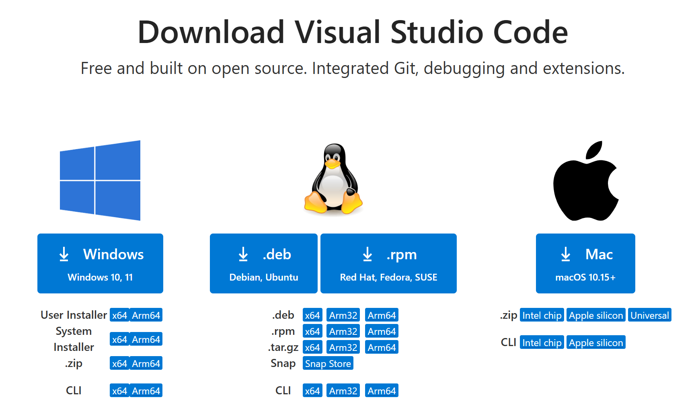

# Introduction to container technology
Installing the tooling for your preferred development environment to work on Atari Lynx code might turn out to be quite some work, repetitive, error-prone and hard to transfer or keep in sync with your code. Also, it usually requires certain prerequisites and tools to be present and installed on your development machine. When you work on more than one codebase and these assume different versions of the development suite, it might be even harder to maintain and run multiple versions simultaneously.

Over the past years container technology has become well established. Containers offer a runtime environment inside a host machine with isolation from its host for compute, storage and network. This makes container technology an efficient and safe way to run one or more instances of environments, that have their own programs, files and network access, without affecting your host computer. Containers share the operating system (OS) kernel with its host, but do not need to be exactly the same. Linux kernels are highly compatible, allowing you to run different Linux ditributions on any Linux machine. A Windows based host can leverage the Windows Subsystem for Linux (WSL) and virtualization to run both Windows and Linux containers.

## Container images
The "contain" part also refers to the fact that the environment contains all relevant prerequisites and installation. These are captured in container images that bundle all preparations for a working environment in a layered structure of files. Typically, a container image is built from a `Dockerfile` that describes the steps to execute to prepare the container environment in a flat-file text format. A container instance is started using an image of choice. Each container gets the exact same starting pointbased on the immutable image it was started from. Because of the isolation you can have multiple environments and versions running side by side, all having different files and used for different purposes, without interfering with each other.

Once container images are built locally or using automation pipelines, they can be stored and shared in a central location called container registries. Inside a registry you will find separate repositories for container images. One container repository is home to a single container image with all its variations and versions. When starting a new container instance you refer to the desired image location by its name and tag. This location can be a local image or one from a remote registry. 

## Running containers
Currently, there are several container stacks to choose from. The two predominant stacks are `Docker` and `Podman`. Both have installers for Windows, Linux and MacOS, so you should be able to find one to suit your needs. A stack typically consists of an container engine, to coordinate management and interaction of containers, plus additional tooling, such as an Application Programming Interface (API) for programmatic interaction and a command-line interface (CLI) for a terminal or batch-based support. 
A container can be started, paused and restarted whenever applicable. The container engine of the stack will manage all container instances, the available images, networking and other elements related to working with containers. The good part is that containers can be deleted after they were stopped. The deletion of the instance will remove all traces of the container that got created as part of the running and interaction with it. This means that all changes that seem to have been made to the original container image will disappear. Because the host system never had anything specific installed for the particular container, everything is completely clean and back to the state it was in before starting the container. Any changes that were made to the file system of the container were only happening inside the container. It would also destroy all your work that you performed in it. 

## Mounting files and folders
Containers can also mount files from the host, offering direct access to the  
host's file system, provided this way allowed and given by the host. Mounts appear as folders and files in the container. By storing your work in a mount location you essentially save your work outside of the container, thereby keeping it safe and avoiding loosing it whenever the container instance is deleted.

# Using containers as development environments
In the introduction to container technology we steered clear of details to work with container instances and images, as this is beyond scope at the moment. You can find a plentitude of books and online references on the topic of containers. It is recommended to read more on the topic if you want to learn about the underlying technology.
Hopefully you did get the idea that containers can be a great way to build and maintain runtime environments for development in general and retro games in particular. We can leverage the functionality and features to setup `cc65` and `newcc65` with `BLL` in container images and run our development environment as a container instance. You can adopt this way of working without much need to understand the details of containers. It will help if you do know more, but you can work with development containers regardless.

## Developing using containers
A development container is in essence a container. It has been enriched in such a way that it caters for typical needs when developing programs. This includes tools to work with the code, such as `Git` for version control, `make` to automate the build process and compilers like GNU C. In addition there is usually some form of connectivity support to work with these containers from an Integrated Development Environment (IDE). 

In 2021 Microsoft started standardizing work on development containers. These were called `Remote Containers` at the time, which was later renamed to `Devcontainers`. The specification of devcontainers have been open sourced and can be found at https://containers.dev. The specification aims for an un-orchestrated single container approach. It introduces concepts such as templates and features for reuse and offers configuration for both coding environments and continuous integration scenarios to build and test code.

Devcontainers are defined and configured in a `devcontainer.json` file according to the specification. The most important aspect of the JSON file is the reference to the container image. This can be a pre-built container image or a `Dockerfile` describing how to build it. The rest of the file contains the configuration of the lifecycle of the devcontainer with lifetime hooks during startup, features to include and customizations for tooling. Here is an example for the `cc65` devcontainer configuration file:

``` json
// For format details, see https://aka.ms/devcontainer.json.
{
	"name": "cc65",
	"build": {
		"dockerfile": "Dockerfile",
		"args": { 
			"VARIANT": "3.20",
			"CC65_VERSION": "latest"
		}
	},
	"features": {
		"ghcr.io/atarilynx/devcontainers/make_lnx:latest": {},
		"ghcr.io/atarilynx/devcontainers/sprpck:latest": {}
	},
	"customizations": {
		"vscode": {
			"settings": {
				"terminal.integrated.shell.linux": "/bin/ash"
			},
			"extensions": [
				"ms-vscode.makefile-tools",
				"ms-vscode.hexeditor"
			]
		}
	},
	"runArgs": [ 
		"--env-file", ".devcontainer/devcontainer.env"
	]
}
```

As you can see there is mention of a `Dockerfile` file, which takes two arguments for the Alpine Linux version and the `cc65` version to use. It includes two features to give the environment access to the `make_lnx` and `sprpck` tooling. The Dockerfile specifies the step by step instructions to install the `cc65` tooling on a Linux based OS, such as Alpine in this case.

Inside the `Doickerfile` you will see an script to run commands during the construction of a container image. The capitalized commands `RUN`, `ARG`, `WORKDIR` and `CMD` are Docker commands that compose the resulting image. The `Dockerfile` listed below instructs the container engine to download and install the sources for the `cc65` compiler suite based on the selected base Alpine image and a specific version of `cc65` from a branch in the GitHub repository at https://github.com/cc65/cc65.

``` docker
# [Choice] Alpine version: 3.13, ..., 3.20
ARG VARIANT="3.20"

FROM mcr.microsoft.com/vscode/devcontainers/base:alpine-${VARIANT} as build
ARG CC65_VERSION="latest"

WORKDIR /usr/src
RUN git clone https://github.com/cc65/cc65.git && cd cc65 && \
    if [ "${CC65_VERSION}" != "latest" ]; then \
    git checkout tags/V${CC65_VERSION} -b "tag-${CC65_VERSION}"; \
    fi && \
    nice make -j2 && make install PREFIX=/usr prefix=/usr && \
    rm -rf /usr/src/cc65

WORKDIR /usr
CMD ash
```

The container image is based on the image `mcr.microsoft.com/vscode/devcontainers/base:alpine` in a version based on the argument in the `devcontainer.json` file. By default this will be `3.20` if not specified there.

Finally, the devcontainer configuration refers to an devcontainer.env file containing environment variables to load at the start of the container.

``` env
CC65_HOME=/usr/share/cc65
CC65_INC=/usr/share/cc65/include
CA65_INC=/usr/share/cc65/asminc
LD65_CFG=/usr/share/cc65/cfg
LD65_LIB=/usr/share/cc65/lib
LD65_OBJ=/usr/share/cc65/obj
```

You should recognize these entries as the environment variables required by the `cc65` suite.

## Running a devcontainer
The next step is to start working with your environment by starting the devcontainer. In general there are two ways to run the devcontainer:

1. **`devcontainer` CLI**  
   You can use the `devcontainer` CLI command to manage instances of devcontainers. You can start a new instance as specified in `devcontainer.json` configuration. Using the CLI you will be required to use several arguments to indicate the location of the configuration, Docker tooling and various folders. Although possible to work from a terminal window with the CLI, it is mostly intended for use in scripts and automation scenarios.
2. **Supported IDEs and tooling**  
   There are a number IDEs that provide support for devcontainers, such as Microsoft Visual Studio Code and JetBrains Rider. These coding tools offers text editors and can manage devcontainer instances for you, right from the IDE with a graphical user interface. The support makes it easy and transparent to work with devcontainers and is recommended over the CLI for almost all regular work and situations.
   
We will use Visual Studio Code where examples are needed. However, you are free to choose your favorite tooling and IDE.

The configuration files are typically located in the root of your source code folder. This keeps the sources for game code as well as the development environment together and in sync. It simplifies getting started and transferring your setup to different people, hardware and environments. The files for a devcontainer are usually located in a `.devcontainer` folder at the root of your code structure. The tooling also assumes it is there, unless specified otherwise. After starting the devcontainer your IDE will offer a developer experience almost indistinguishable from local development on your host system. 

The first time you start a devcontainer it might take extra time to download or build the container image. If you have a `Dockerfile` the image will be built locally. Prebuilt images are going to be downloaded from the specified container registry. Container images can become rather large, ranging from hunders of Megabytes to one or more Gigabytes.

# Getting started
The first step to use containers for development is to install the container management tooling. You can use the following stacks:
- [Docker for Desktop](https://www.docker.com/products/docker-desktop/)  
  Requires a license for professional use, but is free for personal use.
  You can find versions for [Windows](https://docs.docker.com/desktop/install/windows-install/), [MacOS](https://docs.docker.com/desktop/install/mac-install/) and [Linux](https://docs.docker.com/desktop/install/linux-install/). 
- [Podman](https://podman-desktop.io/downloads)  
  No license required and also offers installations for Windows, Mac and Linux using downloads and managers `winget`, `brew` and `flathub` respectively.

In addition you will need a development IDE with devcontainer support. The [supported tools and services](https://containers.dev/supporting) lists Visual Studio Code, Visual Studio 2022 (for C++ only) and IntelliJ IDEA. Jetbrains Rider is also offers support for devcontainers. For free and cross-platform use you can choose [Microsoft Visual Studio Code](https://code.visualstudio.com/download). 

We will cover the steps to get started using Visual Studio Code. 

# Getting started
The first step to use containers for development is to install the container management tooling. You can use the following stacks:
- [Docker for Desktop](https://www.docker.com/products/docker-desktop/)  
  Requires a license for professional use, but is free for personal use.
  You can find versions for [Windows](https://docs.docker.com/desktop/install/windows-install/), [MacOS](https://docs.docker.com/desktop/install/mac-install/) and [Linux](https://docs.docker.com/desktop/install/linux-install/). 
- [Podman](https://podman-desktop.io/downloads)  
  No license required and also offers installations for Windows, Mac and Linux using downloads and managers `winget`, `brew` and `flathub` respectively.

In addition you will need a development IDE with devcontainer support. The [supported tools and services](https://containers.dev/supporting) lists Microsoft Visual Studio Code, Microsoft Visual Studio 2022 (for C++ only) and IntelliJ IDEA. Jetbrains Rider also offers support for devcontainers. Look at the licensing requirements to check whether you are eligible for free use, or require a paid license or subscription.

## Using Visual Studio Code
We will cover the steps to get started using Visual Studio Code. You can download [Microsoft Visual Studio Code](https://code.visualstudio.com/download) for free.  



Pick the correct operating system you are using and install Visual Studio Code. After installation completes, start the development environment. You should the IDE of Visual Studio Code. 

The next step is the setup of the required extensions for Dev Containers. You will need to include at least the `Dev Containers` extension. Press `Ctrl+Shift+X` to open the extension manager. You need the `Dev Containers` extension, which you can install by searching for the name or by using the extension identifier `ms-vscode-remote.remote-containers`.  


At this point you are ready to start using a devcontainer for your project.
