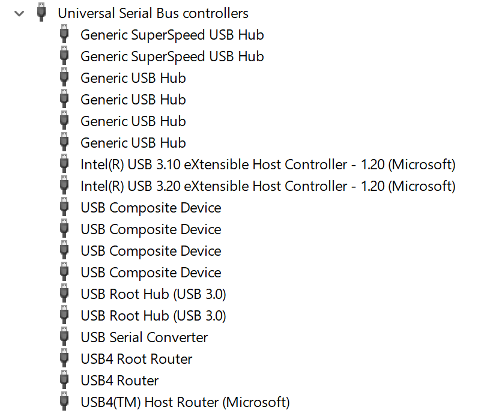

https://learn.microsoft.com/en-us/windows/wsl/connect-usb

# Connecting USB devices to a dev container
For Atari Lynx development you are likely to use an USB based adapter for UART communication between your Atari Lynx and development machine. Our example for now is a FTDI USB serial adapter, that is connect to a ComLynx cable and utilizes serial communication to the Lynx. Typically, this is for uploading BLL based programs to the Lynx, or ComLynx inspection for multiplayer game development. Serial devices are presented as COM ports on Windows or `/dev/tty*` for Linux in most cases.

Working with development containers on a Windows OS brings a challenge if you want to use such USB devices for COM ports. By default USB devices and consequently COM ports are not accessible from a container, due to the missing native support. It is possible to bridge between the Windows operation system and the Linux based container OS by using additional tooling.

The `USB/IP` open source project has a tool `usbipd-win` that is capable of connecting USB devices to a linux distributiuon running via Windows Subsystem for Linux (WSL). Your USB devices can include serial and UART devices, such as adapter based on FTDI, Prolific and Silicon Labs chipsets, that you might use for ComLynx and serial connections to the Lynx from your developer machine. The tool leverages the [USB/IP Protocol](https://www.kernel.org/doc/html/latest/usb/usbip_protocol.html) that has been part of Linux kernels since 2009 to forward USB traffic from Windows to Linux over a virtual network interface.  

The `usbipd-win` tool has a command-line interface (CLI) to discover any USB devices that are attached to your physical machine, and attach and bind these to WSL. In effect it allows your USB device to be connected and exposed to any Linux container running via WSL on Windows. Upon connection the original USB device is reconfigured as an `USBIP` device. The new device creates an IP address to allow connectivity to the container over TCP/IP.

## Installing `uspipd-win` on Windows
The devcontainers you are using have a Linux kernel version that is higher than the minimum required version of `5.10.60.`.  
There are two ways to setup `uspipd` on your Windows system:
1. Download and install the latest release from the project website:  
   https://github.com/dorssel/usbipd-win
   You can find a Windows MSI installer package.
2. Use the `winget` Windows Package Manager to download and install the latest release.
   ```
   winget install --interactive --exact -- dorssel.usbipd-win
   ```

## Attaching a USB device 
Looking at your devices with Device Manager in Windows you should be able to locate the USB device you want to connect.  



This particular FTDI device presents itself as a COM port on Windows, `USB Serial Port (COM1)` in the picture below.


With `upbipd-win` installed you can check the available USB devices on your machine by running `uspipd list` in a terminal window with administrator priviliges:

```
c:\> usbipd list 
Connected:
BUSID  VID:PID    DEVICE                                                        STATE
4-2    0403:6001  USB Serial Converter                                          Not shared
4-9    045e:0990  Surface Camera Front, Surface IR Camera Front                 Not shared
4-10   8087:0026  Intel(R) Wireless Bluetooth(R)                                Not shared

Persisted:
GUID                                  DEVICE
```

Find the USB device you want to connect to your container. In the output above this would be the line that reads  `4-2    0403:6001  USB Serial Converter`, referring to the FTDI USB serial adapter.  
If you are having trouble finding your device based on the description, you can try disconnecting it and running the `list` command again. Your device should no longer be present in the list. Alternatively, you can run `usbipd list --usbids` which will list the device descriptions as found in a Linux database instead of the original description from the device drivers.

```
usbipd list --usbids
Connected:
BUSID  VID:PID    DEVICE                                                        STATE
4-2    0403:6001  Future Technology Devices International, Ltd, FT232 Seria...  Not shared
4-9    045e:0990  Microsoft Corp., Unknown device                               Not shared
4-10   8087:0026  Intel Corp., AX201 Bluetooth                                  Not shared
```

Note the bus identifier `4-2` and `VID:PID` value of `0403:6001`, which we will use for the next set of commands. Make sure you use your specific identifiers, which most likely will be different from the ones shown here.

You need to first bind this USB device and then attach it to WSL by using two separate CLI commands.
Perform a bind of your USB device using your identifier:

```
usbipd bind --busid 4-2
```

The `bind` command binds your USB device and makes it shareable to other devices, including your own machine and WSL. During the binding process nothing spectacular happens. The device will be shared and marked as having such state. You can inspect the results of the `bind` command by asking for the list again.

```
usbipd list
Connected:
BUSID  VID:PID    DEVICE                                                        STATE
3-5    045e:0855  USB Input Device, Microsoft Surface Thunderbolt(TM) 4 Dock    Not shared
4-2    0403:6001  USB Serial Converter                                          Shared
4-9    045e:0990  Surface Camera Front, Surface IR Camera Front                 Not shared
...
```

The next step will perform an attach of the shared device to the Windows Subsystem for Linux. During the attach procedure, the original USB device and its function will disappear from your list of devices. It is replaced with a new USB controller. 
```
usbipd attach --wsl --busid 4-2
```

This command attaches to all WSL distributions you have installed. You can be more specific and target a single distribution. Your output in the terminal window might look similar to this:

```
usbipd: info: Using WSL distribution 'Ubuntu-22.04' to attach; the device will be available in all WSL 2 distributions.
usbipd: info: Using IP address 172.23.48.1 to reach the host.
```

At this point your USB device will disappear as the original device and appear as a `USBIP Shared Device` under USB Serial Bus Controllers. 


You can also have `usbipd` automatically re-attach any devices that got disconnected by unplugging and reconnected by plugging in again. Specify the `--auto-attach` option when attaching the USB device.  
After the second command the terminal window will be captured by the auto-attach and shows any attach and detach events of your device. Keep this terminal window open.

```
usbipd: info: Using WSL distribution 'Ubuntu-22.04' to attach; the device will be available in all WSL 2 distributions.
usbipd: info: Using IP address 172.23.48.1 to reach the host.
usbipd: info: Starting endless attach loop; press Ctrl+C to quit.
WSL Attached
```

## Mapping a shared USB device to a container
The `usbipd-win` tool created a USBIP Shared Device with an IP address. This allow it to be shared with WSL, where it will appear as `/dev/ttyUSB0`, where the actual number might be different.

First check whether the device has been mapped correctly. Start a `wsl` session on your machine by opening a terminal window directly in WSL or by entering the `wsl` command. Inside the Linux shell, run the command `lsusb` to list all USB devices inside the Linux subsystem.

```
$ lsusb
Bus 002 Device 001: ID 1d6b:0003 Linux Foundation 3.0 root hub
Bus 001 Device 008: ID 0403:6001 Future Technology Devices International, Ltd FT232 Serial (UART) IC
Bus 001 Device 001: ID 1d6b:0002 Linux Foundation 2.0 root hub
```

The mapped device should appear in this list. If not, it could be that your Linux distribution does not include the necessary or correct version of the USP/IP drivers and database.
In addition, you can list all devices that are mapped to your Linux environment:

```
$ ls /dev/tty*
/dev/tty    /dev/tty15  /dev/tty22  /dev/tty3   /dev/tty37  /dev/tty44  /dev/tty51  /dev/tty59  /dev/tty9
/dev/tty0   /dev/tty16  /dev/tty23  /dev/tty30  /dev/tty38  /dev/tty45  /dev/tty52  /dev/tty6   /dev/ttyS0
/dev/tty1   /dev/tty17  /dev/tty24  /dev/tty31  /dev/tty39  /dev/tty46  /dev/tty53  /dev/tty60  /dev/ttyS1
/dev/tty10  /dev/tty18  /dev/tty25  /dev/tty32  /dev/tty4   /dev/tty47  /dev/tty54  /dev/tty61  /dev/ttyS2
/dev/tty11  /dev/tty19  /dev/tty26  /dev/tty33  /dev/tty40  /dev/tty48  /dev/tty55  /dev/tty62  /dev/ttyS3
/dev/tty12  /dev/tty2   /dev/tty27  /dev/tty34  /dev/tty41  /dev/tty49  /dev/tty56  /dev/tty63  /dev/ttyUSB0
/dev/tty13  /dev/tty20  /dev/tty28  /dev/tty35  /dev/tty42  /dev/tty5   /dev/tty57  /dev/tty7
/dev/tty14  /dev/tty21  /dev/tty29  /dev/tty36  /dev/tty43  /dev/tty50  /dev/tty58  /dev/tty8
```

Your device should appear as a mapped USB device in this list. 

Since a container is isolated from its host, we need to mount the device during startup of the container. You can use the run arguments of the container to specify a specific device. The `devcontainer.json` configuration has a section for the run arguments of a container. You can add an additional argument for the device being attached to the container.

``` json
{
	"name": "cc65",
    // ...
    "runArgs": [ 
	    "--env-file", ".devcontainer/devcontainer.env",
        // Attach USB device 0 from host to container
	    "--device", "/dev/ttyUSB0:/dev/ttyUSB0", 
	    "--privileged"
    ],
	"mounts": [
		"type=bind,source=/dev/serial,target=/dev/serial"
	]
}
```

You can also see that there is a mount of `/dev/serial` from WSL to the devcontainer. 

Once your devcontainer has started, check whether the USB device has been exposed by running `lsusb` in a terminal session inside the container. 

> #### Hint  
>  If your Linux distribution is missing the `usbutils` package, you can add it to your container when you want to inspect USB devices with `lsusb`. 
> ``` 
> sudo apt update
> sudo apt install usbutils
>  ```
> where you might not need the `sudo` if you are running as root or with sufficient priviliges
{: .block-tip }

The output of the `lsusb` command will look similar to before, when you ran it inside a WSL session. Depending on the Linux distribution of your base image for the devcontainer, it might be using a different database. The bus and device identifiers will be the same with slightly different names and descriptions. If the device names are missing, you should install the `usbutils` package to get the better one. 

```
$ lsusb
Bus 002 Device 001: ID 1d6b:0003 Linux 5.15.153.1-microsoft-standard-WSL2 vhci_hcd USB/IP Virtual Host Controller
Bus 001 Device 011: ID 0403:6001 FTDI FT232R USB UART
Bus 001 Device 001: ID 1d6b:0002 Linux 5.15.153.1-microsoft-standard-WSL2 vhci_hcd USB/IP Virtual Host Controller
```

The final step is to figure out the actual device name under `/dev`. Porbably this will be `/dev/ttyUSB0`, but whenever you need to make sure or do not know, you can look at the symlink files under `/dev/serial`. The output of a list of files could be.

```
$ ls /dev/serial
usb-FTDI_FT232R_USB_UART_A402QLMV-if00-port0
```

The more elaborate way to find out is to go back to WSL and execute the following commands there:
```
find /sys/bus/usb/devices/usb*/ -name dev
udevadm info -q property --export -p /sys/bus/usb/devices/usb1/1-1/1-1:1.0/ttyUSB0/tty/ttyUSB0
```

You may have to install the package `eudev` for Alpine or `udev` for Ubuntu and Debian.


# Notes: To be finished

Create a file named /etc/udev/rules.d/99-serial.rules. Add the following line to that file:
```
KERNEL=="ttyUSB[0-9]*",MODE="0666"
```
https://www.losant.com/blog/how-to-access-serial-devices-in-docker

```
stty -F /dev/ttymxc2 115200 # set baud rate
stty -F /dev/ttymxc2 -crtscts # disable flow control
```
Set uart parameters
https://developer.technexion.com/docs/using-uart-from-a-linux-shell
