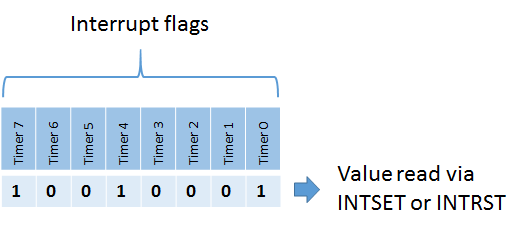
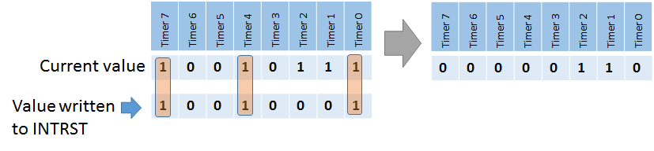
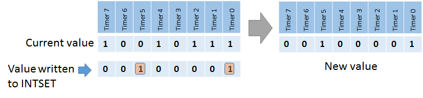

During normal operation the 6502 executes instructions by evaluating the opcodes at the current program counter `PC`. It fetches the instruction located there and spends a couple of processor cycles performing the work. The program counter is updated to point to the next instruction. Usually this is the next instruction in memory, but it can be somewhere else in case of branching (e.g. BEQ, BMI) or jumping (JMP, JSR). This mode of operation simply follows the flow of your code.

## 6502 family processor interrupts

Normal operation can be interrupted by special events that occur. In most cases this is the hardware telling the processor that something important has happened, such as input that is available (keyboard, serial IO), or a timer that has expired and wants you to give you a chance to handle that. These special events are appropriately called interrupts and they trigger a specific sequence of action by the processor. The 6502 has two kinds of interrupts:

1. **IRQ**: **I**nterrupt **R**e**Q**uests, which are normal interrupts
1. **NMI**: **N**on-**M**askable **I**nterrupts, more important interrupts than the IRQ interrupts

Both IRQ and NMI are essentially the same interrupts, except for an important distinction: normal interrupts can be "ignored" (also called masked), while NMI interrupts cannot be masked. This means that you can specify you do not want the IRQ interrupts to actually interrupt you, for example if you are in a critical piece of code execution, while NMI can never be suppressed.

The processor has physical interrupt pins for IRQ and NMI that are (optionally) connected to the hardware that can signal an interrupt. The most critical hardware will use the NMI pin, while other hardware uses the IRQ pin.

Both the IRQ and NMI signal are high by default and will trigger when it goes low. These lines can be edged or level sensitive. Usually IRQ lines are level sensitive and will keep firing as long as it stays low. The NMI line on the other hand is edge sensitive in most cases and only triggers on a falling edge to avoid having it triggered over and over again. That would be bad since these cannot be ignored, so it will cause a flood of interrupts.

## 6502 interrupt sequence

Whenever an interrupt occurs, be it an IRQ or NMI, the 6502 executes a sequence to stop the current execution of code, and render control for the handling of the interrupt to an interrupt service routine (ISR). The ISR location is determined from what is called an interrupt vector. Essentially a vector is a memory location where the processor can find the jump address for the reset, IRQ or NMI routine. There are three vectors in the 6502:

|Vector|Description|Address (low, high byte)|
|---|---|---|
|NMI|Vector to NMI ISR|`$FFFA`,`$FFFB`|
|Reset|Vector to address of reset routine|`$FFFC`,`$FFFD`|
|IRQ|Vector to IRQ interrupt service routine|`$FFFE`,`$FFFF`|

The picture below (from the interrupt tutorial at wilsonminesco.com) shows what happens at the processor level per clock cycle.


Whenever an NMI or IRQ interrupt occurs, the currently executing instruction is finished first. As soon as that is done, the current program counter (address of next instruction) is pushed onto the stack. First the high byte, then the low byte. Next, the status register (processor status or `PS`) is also pushed onto the stack. Finally, the IRQ or NMI vector is fetched from their respective addresses and the processor will continue execution at the vector addresses.

You can think of the interrupt and the vectors as `JSR` to the addresses specified at `$FFFE` and `$FFFA`. Something like `JSR ($FFFE)` for IRQ and `JSR ($FFFA)` for NMI. It is not exactly the same, because the `PS` is also placed onto the stack and the exact `PC` value is somewhat different, plus you return from a `JSR` with an `RTS`, but with a `RTI` (ReTurn from Interrupt) for a IRQ or NMI. Other than that the two are comparable to a certain extent.

## A "Hello World" Interrupt Service Routine

A really simple interrupt service routine might look like this, starting at memory location `$E000`:

```6502
F000  INC $1337
F003  RTI
```

It could have been as simple as a single `RTI` instruction, but that would have been essentially a stubbed out handler to would return as soon as it is called without actually doing anything. Useful only when you want to have an empty ISR. Instead, the example above shows a counter at address `$1337` is increased every time that the ISR is executed.

You need to put the address of the ISR (`$F000` in this case) in the IRQ interrupt vector during startup, or an interrupt will jump to an unknown location. The initialization of the IRQ vector can be done as follows:

```6502
SEI         ; Disable interrupts to not get interrupted at this point 
LDA #$00
STA $FFFE   ; or STZ $FFFE for short
LDA #$F0
STA $FFFF
STZ $1337   ; Initialize the data register
CLI         ; Re-enable interrupts
```

This puts the bytes `$00` and `$F0` at the low and high byte of the IRQ vector at `$FFFE` and `$FFFF` respectively. Notice that two additional instructions `SEI` and `CLI` are used at the beginning and end of the routine to avoid being interrupted during the setting of the IRQ vector. These instructions deserve some additional explanation.

## Don't interrupt me

There are occassions when you do not want interrupts to occurs. These are some typical moments when it is inconvenient to be disturbed:

- **ISR is already executing**  
  Once an ISR is executing it can be impractical to have a new IRQ come in and trigger a new ISR from the current ISR. That would make it a bit like the movie Inception, where dreams occur within dreams within dreams within dreams… You get the picture.
- **Manipulation of vector address values**  
  When you have changed either the low or high byte but not the other, there is a very brief moment where the vector address is invalid. Should an interrupt request come in at that particular time, it will probably lead to unwanted and unexpected behavior.
- **Bootstrapping or initialization code is running**  
  At this time things may not have been properly setup for the program and data registers to start executing ISR code.

The 6502 processor has a bit flag in the processor status called `I` (for Interrupt Disabled) that determines whether an IRQ is acknowledged or not. When the `I` bit is set, no IRQ requests are responded to, allowing you to safely handle interrupts without being interrupted by new ones. NMI interrupt requests are unaffected by the bit, because they are unmaskable and cannot be suppressed or ignored.

You can influence the bit with two instructions:

```6502
SEI    ; Set Interrupt Disable flag: masks IRQ interrupts
CLI    ; Clear Interrupt Disable flag: listen to IRQs again.
```

Typically you use these instructions when performing interrupt critical logic, such as setting up the various interrupt and reset vectors in the processor like in the example above.

By default new IRQ interrupts are ignored during an ISR, as the 6502 sets the `I` flag to `1`. So, you do not have to call SEI at the start of your ISR code, be it IRQ or NMI triggered. In addition, a call to `RTI` will restore the processor status `PS` from the stack, which includes the state of the `I` flag prior to the ISR. So you also do not need to call `CLI` before returning from your ISR if you end with an `RTI`.

When an NMI or IRQ interrupt service routine is executing, you can choose to call `CLI` and let new IRQ requests come through, should they occur.

When an IRQ line is level-sensitive it is important to note that when the level is still low, a new IRQ will immediately fire again. Luckily, the Lynx has edge-sensitive IRQs, so you don’t have to take that into account, except for UART interrupts as these are level sensitive. You will want to clear the special interrupt bits via a hardware register before calling `CLI` to accept new IRQs or `RTI` to return from an interrupt. Otherwise, the bits keep indicating that certain timer IRQs occurred.

## Interrupt sources in Atari Lynx

The Lynx has 8 distinct hardware sources that trigger interrupts. The hardware is always a timer in the Lynx. There are no interrupts from external hardware such as a keyboard, mouse or other peripheral. Since the Lynx has 8 timers, an interrupt can come from each (and all) of those sources. The interrupt routine will fire at the expiration of a timer with the exception of timer 4.

Here is a quick recap of the timers that Mikey holds and their relation to interrupts:

|Timer #|Description|Relation to interrupt|
|---|---|---|
|0|Horizontal blank (`HBLANK` or `HBL`)|Fires when the end of a "scanline" has been reached|
|1|General purpose timer 1||
|2|Vertical blank (`VBLANK` or `VBL`)|Fires interrupt after all lines on a screen have been drawn. Useful for doing work that is screen critical (such as the moment of swapping screen buffers)|
|3|General purpose timer 3||
|4|UART RX or TX related|Doesn’t fire at timer expiration, but rather at the moment when data has arrived in receive buffer or when transmit buffer is empty|
|5|General purpose timer 5||
|6|General purpose timer 6||
|7|General purpose timer 7||

Each of these timers have an Enable Interrupt bit (left-most bit number 7 represented by value `$80` or `ENABLE_INT`) in their static control register `A`. Only when this bit is set (enabled) will the interrupt fire at the moment of timer expiration. In code this would look something like this in 6502 assembler:

```6502
STA #ENABLE_INT|ENABLE_RELOAD|ENABLE_COUNT|AUD_64;
STA TIMER1+TIM_CONTROLA
LDA #$FF
STA TIMER1+TIM_COUNT
STA TIMER1+TIM_BACKUP
```

The one exception here is timer 4, also known as the UART or serial timer. This timer’s interrupt does not fire at the timer expiration. The purpose of the timer is to generate the baud rate for UART. It will expire at a steady pace to transfer the single bits of data, plus some extra such as the start, stop and parity bit. Most of the timer expirations do not really matter. The relevant moment to fire an interrupt for UART is when data has arrived in the receive buffer, or when there is no more data to be sent (if the transmit buffer runs empty) and a new byte needs to be written to the transmit buffer. You need to set the TX and RX Interrupt Enable flags (`TXINTEN` and `RXINTEN`) in the `SERCTL` hardware register at `$FD8C` to enable UART interrupts.

```6502
LDA #TXINTEN | RXINTEN | PAREN | RESETERR | TXOPEN | PAREVEN;
STA SERCTL ; $FD8C
```

This code fragment enables both receive and transmit interrupts, besides the normal settings for enabling even parity while resetting any errors and switching the UART to open collector.

In summary, the timers will generate IRQs when they are configured to do so. The timers will always run, no matter what type of code is executing. Once expired they will generate an interrupt if enabled for that timer through its A control. This will only cause the call of the ISR through the IRQ vector when the I flag of the processor status register is not set.

## Inspecting interrupt sources

When an IRQ occurs it is often necessary to determine the source (or potentially sources) of the interrupt. It could be any one of the 8 timer sources or a combination of them. Each of the timers has a interrupt flag associated with it. Every interrupt flag that is set will cause the IRQ signal to be low and raises an interrupt in the 6502 processor.

The 8 bits of the interrupts flag fit exactly into a byte. Mikey has two special interrupt related hardware registers for that specific byte. These are `INTRST` at address `$FD80` and `INTSET` at `$FD81`.

{:width="400px"}

Their purpose is to allow you to expect and manipulate the sources of the interrupts by looking at the bytes of the value located of each address and writing to them. The addresses hold the same set of bits when you read from either one. The value for `INTSET` or `INTRST` holds the bits from the interrupt flags in this order: timer 0 at bit 0 up to timer 7 at bit 7. 

Writing to `INTSET` and `INTRST` is a totally different thing. `INTRST` will set interrupt flags to zero when written to. It clears the flags for the bits that are present in the (mask) value you write to `INTRST`. It leaves the other bits unaffected.

{:width="600px"}

`INTSET` will push the values written into it to the interrupt flags. It provides an easy way to reset them all by writing a zero `$00` value to it (just like writing `$FF` to `INTRST` would). On the other hand writing a non-zero value will cause an interrupt flag (or flags) to be set, effectively causing an IRQ indirectly.

{:width="600px"}

One approach often used is to read from `INTSET` at the beginning of your ISR code. It will get you the bits for the expired timers and serial interrupt. After you have nearly finished your ISR you can write the value from `INTSET` to `INTRST` causing those interrupts to be reset. If a new interrupt occurred during the execution of your ISR, the respective bit or bits are unaffected. When the ISR returns to normal code, there is still a bit set in the interrupt flags and a new IRQ will occur. That is probably intented, because you missed a new interrupt and want to handle that as well.

However, the UART triggered interrupts are level-sensitive, so they will keep triggering unless you clear the source explicitly while the interrupts are . Here is an abstract from the Epyx development kit’s documentation on UART and ComLynx:

> ### Epyx SDK documentation  
> **"7. Unusual interrupt condition.**  
> Well, we did screw something up after all. Both the transmit and receive interrupts are 'level' sensitive, rather than 'edge' sensitive. This means that an interrupt will be continuously generated as long as it is enabled and its UART buffer is ready. As a result, the software must disable the interrupt prior to clearing it.  
Sorry."

The way to deal with this hardware error is to simply clear bit 4 of the interrupt flags in your ISR routine, like so:

```6502
; Clear interrupt bit for UART timer (timer #4)
    LDA #$10
    STA INTRST

; Rest of interrupt logic

    RTI
```

Most likely you would clear the interrupt flag for a particular timer anyway after executing the respective ISR logic. This way you can keep track of all interrupts that have been handled in case multiple timer trigger an interrupt sequence at the same time.
