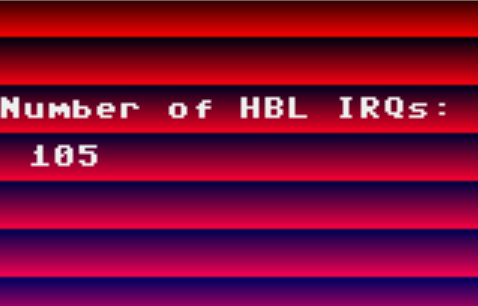

The cc65 compiler allows you to create an interrupt service routine (ISR) through assembler code. In cc65 such routine to handle the occurrence of an interrupt is called an 'interruptor'. There is common and centralized infrastructure to handle incoming IRQ requests, regardless of the console or computer that cc65 targets. We will look at this infrastructure as well as the specific details for the Atari Lynx.

## Writing an interruptor

There is some special syntax required to wire your code to be called when an interrupt fires. It uses the `interruptor` keyword followed by the name of a function that does the actual handling.

Here is a short sample that implements a simple handler, incrementing a memory location `$1337` every time the interrupt fires:

```c
.interruptor _handler

.proc _handler: near

.segment "CODE"
    inc $1337

done:
    clc
    rts

.endproc
```

There is no `RTI` at the end and a `CLC` instruction just before a normal return from subroutine 'RTS' call. The reason is that interruptor handlers are wired together by the ca65 assembler. Each interruptor address is stored in an table. Whenever an IRQ occurs every handler in the table is called in order of priority.

Each handler can indicate whether the other handlers still need to be called. It is the carry flag `C` that conveys this intention. When the carry flag is not set, the calling of other handlers should continue. You can easily clear `C` by using the `CLC` instruction. If the carry flag is set, the handler tells the runtime that it has completely handled and cleared the interrupts, and calling the other interruptors is not needed anymore.

A priority is specified as follows:

```c
.interruptor _vbl, 15
```

The number indicates the priority. A higher value gives the handler a higher priority and makes it being handled before other in case of multiple timer interrupts firing. The default value is 7. You can read some more at the cc65 documentation wiki on the `.interruptor` control command.

There is always a VBL handler created if you use the TGI library. TGI uses a handler to perform a swap of the video buffers at the right time, so no screen tearing occurs. Screen tearing would happen when the swap is performed midway during the drawing of the current buffer. The VBL interrupt is an excellent moment to do it, hence the choice for a VBL handler.

Here are a couple of strategies for building your handlers:

- **Strategy 1:** Create a big handler that checks for each and every interrupt source.  
  This would keep the handler table small and give a single point to have your own interrupt handling logic.
- **Strategy 2:** A handler per interrupt type.  
  It will give small and concise handlers that are easy to maintain. It implies a little more overhead of multiple jumps, but it is disputable if that is noticeable or significant.
- **Strategy 3:** Override the TGI handler by your own.  
  Given that you would need to recompile the TGI library to alter its VBL handler, you could specify your handler with a higher priority and return with a SEC call before the RTS.

## HBL and VBL interrupts

A more complete example is one where we do some effects based on horizontal and vertical blank (HBL and VBL) interrupts. The goal is to change the color of the black pixel each scan line, which creates the banded effect on screen. It is as simple as increasing the red value at $FDB0 (BLUERED0). The difficult part is that this has to be done for every scanline.

By now we know that the HBL occurs when timer 0 expires. It has its interrupt enabled by the boot rom initialization. That part is covered. This is the interruptor we need to include in our code:

```c
.interruptor _hbl
.include "lynx.inc"
.export _hblcount
 
_hblcount:
	.byte   $00
 
.proc   _hbl: near
 
.segment "CODE"
    lda INTSET
    and #TIMER0_INTERRUPT
    beq done  
    inc RBCOLMAP+0
    inc _hblcount
 
done:
    clc
    rts

.endproc
```

Starting from the top, an interruptor is declared to point to the handler routine called `_hbl`. There is also an exported variable called `_hblcount` that serves as a counter for the total number of HBL interrupts. The `CODE` segment loads the interrupt flags from `INTSET` and checks whether the flag for timer 0 (the HBL timer) is set. If so, this handler was called because an HBL IRQ occurred. The logic can continue by increasing the red/blue value in the palette using `RBCOLMAP` and the HBL counter value. Note that increasing the red color through hardware register `BLUERED0` at address`$FDA0` increases the blue value every 16th increment.

If the interrupt bit for timer 0 was not set, the two increase operations are skipped by a branch to `done`. Finally, we clear the carry flag with `CLC` to indicate that other handlers should still execute, as our handler only intends to handle at most one timer.

The other handler for vertical blanks (VBL) interrupts is fairly similar. It does a check for timer 2 instead of 0. In addition it will:

- Increase a frame counter variable
- Reset the red/blue value to zero: a new frame always starts with the same color values
- Store last HBL count to count the number of HBL interrupts firing per frame.

```c
.interruptor _vbl
.include "lynx.inc"
.export _framecount
.export _lasthblcount
.import _hblcount
 
_framecount:
    .byte   $00
_lasthblcount:
    .byte   $00
 
.proc _vbl: near
 
.segment "CODE"
    lda INTSET
    and #TIMER2_INTERRUPT  ; Check for VBL timer
    beq done
 
    inc _framecount
    stz RBCOLMAP+0    ; Reset red/blue value to create steady image
    lda _hblcount
    sta _lasthblcount
    stz _hblcount
done:
    clc
    rts

.endproc
```

{:width="400px"}

When you look at the screenshot above you can see a couple of remarkable things. First, there are 105 horizontal blanks. This is in accordance with the documented 3 scanlines of blank time every frame. Plus, you can see that the HBL for the 3 invisible lines are right after a VBL interrupt. The first band is 3 pixels smaller than the others, which can only happen if the HBL counter was already running 3 lines before the first visible line is drawn.

## C-level interrupts

The cc65 suite also offers the option to handle IRQs with functions implemented in C. It offers two functions `set_irq` and `reset_irq` that allow you to specify an interruptor routine 


The `6502.h` header file includes the definitions needed to include C level IRQ handlers:

```c
/* Possible returns for irq_handler() */
#define IRQ_NOT_HANDLED 0
#define IRQ_HANDLED     1

typedef unsigned char (*irq_handler) (void);
/* Type of the C level interrupt request handler */

void __fastcall__ set_irq (irq_handler f, void *stack_addr, size_t stack_size);
/* Set the C level interrupt request vector to the given address */

void reset_irq (void);
/* Reset the C level interrupt request vector */
```


The implementatino for the interruptors in C is located in `libsrc/common/interrupt.s` and 


## Interruptor infrastructure in cc65

Since cc65 targets many different systems, the initialization of the interruptor infrastructure is implemented separately for each. This allows for variations to the implementations. The Atari Lynx has its implementation in `irq.s` and consists of the `initirq` and `doneirq` methods that are expected for each system.

```6502
.segment        "ONCE"

initirq:
    lda     #<IRQStub
    ldx     #>IRQStub
    sei
    sta     INTVECTL
    stx     INTVECTH
    cli
    rts
```

The initialization will set the interrupt vector of the 6502 processor to point to a method `IRQStub`. It guards setting the low and high byte values for the interrupt vector address `INTVECTL` and `INTVECTH` from interrupts by setting the Interrupt Disable flag `I` using `SEI` and clearing it at the end before returning. The code for `initirq` is located in the `ONCE` memory section, as it is only used at startup and can be discarded afterwards.

The stub for the Interrupt Service Routine has some logic to properly prepare and finish interrupt handling. First, it pushes `Y`, `X` and `A` to the stack before calling the actual interrupt handling routine `callirq` as a subroutine.

```6502
.segment "LOWCODE"

IRQStub:
    phy
    phx
    pha
    jsr     callirq
    lda     INTSET
    sta     INTRST
    pla
    plx
    ply
    rti
```

After the return from `callirq` the implementation is specific for the Atari Lynx. It loads the interrupt bits from `INTSET` and writes these to `INTRST`. This will clear all bits that where set at the moment of reading in the previous instruction. Be aware that this approach might cause any interrupt bits that were set during the call to `callirq` to also be reset, potentially missing a handler that already checked for that particular bit.

The stub is put in the `LOWCODE` segment by convention, although the Lynx does not have banked memory and no real use for code placed low in the available memory range.

The Atari Lynx does not need to release the IRQs, so the `doneirq` method is a simple return from the call.

```6502
.code

doneirq:
    ; as Lynx is a console there is not much point in releasing the IRQ
    rts
```

When the cc65 compiler finds `.interruptor` marked methods it will count the number total number of such interruptor routines in a variable called `__INTERRUPTOR_COUNT__`. A jump vector table `__INTERRUPTOR_TABLE__` holds the values for the interruptor method address, so they can be used to as jump locations for the corresponding interrupt. The method `callirq` found in `callirq.s` is a piece of self-modyfing code that loops through all entries in the table, starting at the highest and working its way down.

```6502
callirq:
        ldy     #.lobyte(__INTERRUPTOR_COUNT__*2)
callirq_y:
        clc                             ; Preset carry flag
loop:   dey
        lda     __INTERRUPTOR_TABLE__,y
        sta     jmpvec+2                ; Modify code below
        dey
        lda     __INTERRUPTOR_TABLE__,y
        sta     jmpvec+1                ; Modify code below
        sty     index+1                 ; Modify code below
jmpvec: jsr     $FFFF                   ; Patched at runtime
        bcs     done                    ; Bail out if interrupt handled
index:  ldy     #$FF                    ; Patched at runtime
        bne     loop
done:   rts
```

The `jmpvec` label is used as an offset to modify the jump location for each iteration in `loop`. The destination of the subroutine is taken from the current entry in the jump table, as it is found by the `Y` value for the interruptor iteration. Similarly, the `index` label is used to modify the test condition for doing another iteration in the loop. Whenever `Y` reaches zero, all interruptors have been called and the interrupt service routine is considered done. The loop is also ended whenever the carry flag is set on returning from the `JSR` to the modified jump location. The carry flag is a way for the interruptor to signal that processing additional interruptors is needed. When `C` is clear on return, a new iteration is done. If `C` is set, the loop terminates. At the beginning the carry flag is cleared, so the default assumes handling should continue, unless indicated otherwise by the interruptor that uses `SEC`.

The Atari Lynx library implementation has three interruptors:

1. Clock (`update_clock` in `libsrc/lynx/clock.s` with priority 2)  
  Driven by the VBL timer, it counts the number of seconds.
1. Uploader (`UploaderIRQ` in `libsrc/lynx/uploader.s` with default priority of 7)  
  Inspects serial interrupt flag to check for debug command bytes to initiate object file upload.
1. Serial driver (`ser_irq` in `libsrc/serial/ser-kernel.s` with priority of 29)  
    
