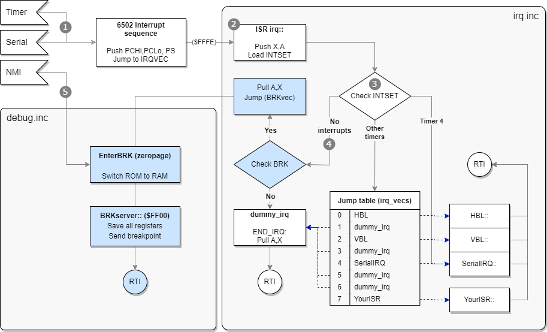

While you are developing programs and games for the Lynx, you sometimes want to debug your code and the flow of execution to find bugs or improve your code. You can usually do most of the debugging with the existing emulators. Handy and Felix have debugging support built in that will help you debug during emulation. They allow immediate entering break mode upon request, inspection of memory to check both RAM and hardware registers, disassembly the code that is currently loaded and even change code and data. In some situations you might find that it is necessary to debug your Lynx code on the actual console. This is less trivial, as a regular Lynx console was never designed for debugging. Still, there are ways that a normal Lynx console can be used to debug your code.

The debugging of Lynx programs on physical hardware requires serial communication between the console and a development machine acting as a host. The Lynx will be the debuggee (program being debugged) and the host runs a debugger program that you operate remote from the Lynx. The communication is established while the program is running, so we need a way to halt the execution of the processor into what is called "break mode". 

## Break mode for debugging

Because normal execution of the program is paused during break mode, the Lynx can communicate with the debugger on the host to exchange information and receive commands for debugging. In order to be able to resume execution at a later moment it is crucial that preparations are made when entering break mode. Essential information about the normal execution needs to be stored, so it can be restored later when exiting break mode and resuming the original flow of code again.

It is not trivial for the program to enter this special break mode on a real Lynx console. Fortunately, there are three ways to stop the control flow of the running code.

1. **Execute a `BRK` instruction inside your code**  
   By inserting a strategically placed `BRK` in your code, the 6502 processor will execute the break routine and run the same routine as an interrupt would do. You can distinguish the reason for the interrupt service routine by inspecting the `B` break flag from the processor status that is stored on the stack. Inside your ISR you can implement anything required to start a debugging session.
1. **Trigger a non maskable interrupt (NMI)**  
   Unlike a regular IRQ interrupt, NMIs cannot be masked to prevent the processor from performing the interrupt sequence and using the appropriate vector. An NMI has a separate vector that the processor will use to jump to its ISR, so you can start the debug session at that point.
1. **Cause a serial interrupt by sending data**  
   Any data that is sent to the Lynx over ComLynx will cause the serial interrupt to fire, provided that it is enabled. Your ISR can determine whether the active interrupt was caused by receiving serial data and enter break mode. The serial interrupt is the only interrupt in the Lynx (besides NMI) that can be triggered externally.

Once in break mode it is up to your 6502 code to act as a debuggee and communicate with the debugger host. The host with the debugger needs to be the counterpart that uses the debugging features inside your Lynx program.

The first option relies on the `BRK` command that is present in all of the 6502 based processors. It is important to learn about the 6502 break routine first. This will help understand what happens during and after execution of the `BRK` instruction and how it can be used to enter break mode for debugging.

## 6502 processor `BRK` routine

The 6502 family processors have a special sequence to handle user breaks. The processor will perform the following sequence whenever a break `BRK` instruction, indicated by opcode `00`, is encountered during execution:

1. Increase program counter `PC` with **two** to skip `BRK` and next byte
1. Push high byte of `PC`
1. Push low byte of `PC`
1. Push the processor status (`PS`) to stack **with the `B` flag set**

Remember that the stack will grow upward to lower memory locations, starting at `$01FF`. The stack will look as follows after the sequence, assuming the pointer was originally at `$01FD`:

```asm
$0100   stack limit
...
$01fa   <- SP points here, just above top of used stack
$01fb   PS
$01fc   PCLo
$01fd   PCHi
...
$01ff   bottom of stack
```

> ### Important
>
> Note that the 4th bit `$10` for the `B` flag is only set on the copy of the status flags that is pushed to the stack. This will happen for both a `BRK` and `PHP` instruction, but not for an IRQ or NMI causing `PS` to be pushed.  
> Whenever the processor status is inspected by using `PLP` it will never have the `B` flag set.
{: .block-warning}

You can determine the reason for a jump to the vector `IRQVEC` at `$FFFE-$FFFF` by inspecting the processor status stored on the stack. After retrieving the value from the stack it is possible to test for the presence of the bit representing the `B` flag. This will allow you to see whether the vector jump was caused by an interrupt (bit is not set) or `BRK` instruction (bit is set).

One approach to inspect the `B` flag on the stack is to use the following code:

```asm
PLA         ; Load status register
PHA         ; Restore onto stack again
AND #$10    ; Isolate B flag
BNE break   ; Branch to `break` routine to enter break mode
; Normal interrupt processeing
...
```

The break routine can be ended explicitly to resume the flow of execution exactly after the `BRK` instruction causing the break. The debug facilities must have logic included to offer non-destructive debugging where the original flow is continued without unintentional side effects. This does require the registers of the processor to be restored to the original state. It is the responsibility of the ISR and the debug code to make sure this happens correctly.

## Adding debug support

The original Epyx development kits for the Pinky/Mandy and Howard/Handy hardware included a debugger program `HANDEBUG` on the Commodore Amiga. It communicates over a serial connection with Mandy and Howard that runs a monitor program. The Epyx debugger allows breaking the execution flow, inspecting and changing registers and memory, and resuming execution again. It does require the SDK hardware, so this type of debugging is only available to a few people that are in possesion of the devices.

The BLL toolkit offers similar debugging features for a regular Atari Lynx without the use of the special Epyx hardware. The library includes support for:

- Entering break mode with user initiated `BRK` instructions
- Debugger communication over the serial ComLynx port once in break mode
- Special debug commands triggered by serial commands during normal operation

The most common scenario for debugging with BLL is by using breakpoint created by adding `BRK` statements in the compiled code. The BLL library leverages the interrupt service routine to transition into break mode.

## BLL interrupt handler for BRK

The BLL ISR includes a small block of code with logic to check for user initiated `BRK` commands.

```6502
irq::
    phx
    pha
    ldx #0
    lda INTSET
IFD BRKuser
    beq .break
ENDIF
    ; Normal IRQ handling

.break
    ; BRK handling
```

First the `X` and `A` registers are pushed onto the stack. It is important to immediately store these, so the values do not get lost. This is particularly important for the debugging features as it relies on manipulating `A` and `X`, while later restoring these before resuming execution.

The hardware register `INTSET` at `$FD81` holds a byte with 8 bit flags representing the eight timers from timer 7 to timer 0 (left to right). Each timer that causes an interrupt will be indicated by that bit flag set.

When the debugging and BRK functionality has been turned on by setting any `BRKuser` value, the logic includes a branch to a dedicated section for BRK handling. This branch is taken when there are no bits set in `INTSET`, meaning that there was no interrupt, implying that a `BRK` instruction must have caused a jump to `IRQVEC`.

The `.break` branch has the rest of the logic for a BRK command.

```6502
IFD BRKuser
.break
    tsx
    lda $103,x      ; Fetch PS register from stack
    bit #$10        ; BRK triggered?
    beq dummy_irq   ; Safe exit should B flag not be present
    pla             ; Restore A and X from stack
    plx
    jmp (BRKvec)    ; Jump to special BRK vector set by InitBRK
 ENDIF
```

You can see how this handling is only available for `BRKuser`. The logic fetches the current stack pointer into the `X` register. At that moment the offset `SP` into the stack is pointing at the next to use value, one above the last stack position used. It is also necessary to account for the fact that both `A` and `X` were stored after the BRK processor sequence. Accordingly, the offset needs to be  increased by three bytes using `LDA $103,x`.

For example, the stack might look like this when a `BRK` instruction was handled and the first part of the IRQ/BRK vector handler has already executed. Assume the stack pointer is at `#$f8` pointing to just above the top of the stack.

```
$0100   stack limit
...
$01f8   <- SP points here
$01f9   A
$01fa   X
$01fb   PS
$01fc   PCLo
$01fd   PCHi
...
$01ff   bottom of stack
```

After the `.break` routine the accumulator holds the `PS` value and is checked for the `B` bit flag. It should be present, because there were no bits set for interrupts and still the IRQ vector was used. Just to be on the safe side, a graceful exit via `dummy_irq` is taken when the `B` flag is not set after all.

Finally, the accumulator and X register are restored and an indirect jump is made to address found in the zeropage `BRKvec` location. When `INITBRK` was used during initialization, the `BRKVec` value was set to the `EnterBRK` routine that prepares the call to the break server.

## Break server to handle debug commands

The subroutine `InitBRK` is responsible for the initialization of the break server. It will copy the break server logic from regular memory (as included as a part of your program) into high memory at $FF00 and onwards.

```6502
_BRKserver set *
  RUN $FF00
```

The code should fit neatly under `$FFF9` where the important hardware register `MAPCTL` and the processor vectors are located. During compilation you can read the current size of the break server and the start location.

```cmd
Baudrate : 62500
Loader size : 55
length of BRK-server : 245
End of BRK-server : $fff5
Possible start : $ff03
```

The actual size of the break server depends on the inclusion of `SERIAL` value. If you choose to use serial support, the break server will include some extra code to re-enable serial interrupts for `RX` when continuing normal operations.

## Internals of break server

When the `BRKuser` constant is set in your code, the BLL interrupt service routine will perform an additional check for the break condition, as indicated at point 4 in the next figure.



Whenever a user-initiated BRK is detected, the accumulator `A` and register `X` are stored and an indirect jump to the address stored in `BRKvec` is made.

The initialization of the IRQ infrastructure prepares the jump table to point all 8 entries to the `dummy_irq` handlers. Additionally, it is going to include the `BRKvec` memory and initialize it to `dummy_irq` as well.

```6502
 BEGIN_ZP
IFD BRKuser
BRKvec	ds 2
ENDIF
 END_ZP
```

When `BRKuser` is set, you also need to
It will also add the `BRKvec` variable to zeropage memory.


 break your program you need to original BLL interrupt service has extra co section for debugging and

```6502
InitIRQ::
	php
	sei
; ...
	bpl .loop
IFD BRKuser
	lda #>dummy_irq
	sta BRKvec+1
	sty BRKvec
ENDIF
	plp
	rts
```

