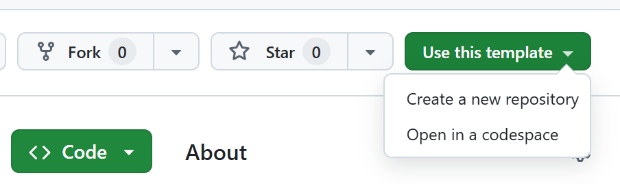
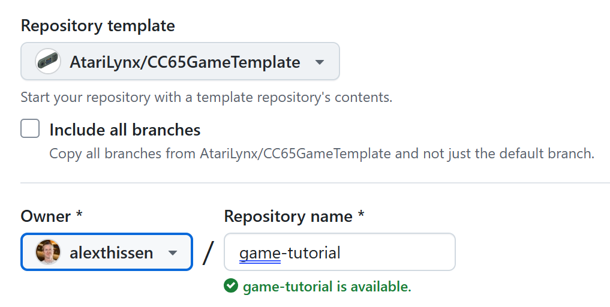
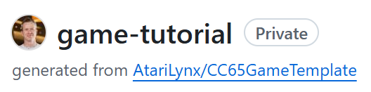
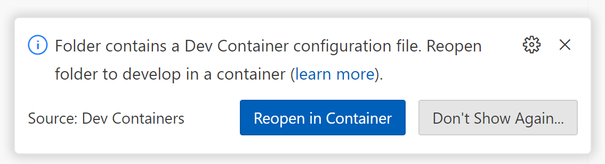
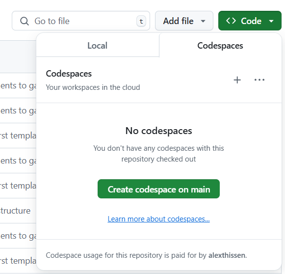
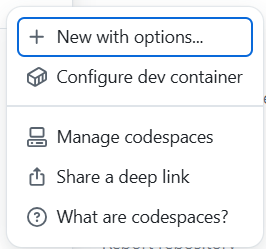
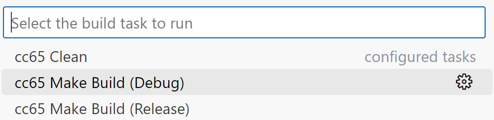

Create a repository from cc65 game template



Choose the owner and give it a name of your choice, for example `game-tutorial`.




Clone the repository to your local computer:

```
git clone https://github.com/alexthissen/game-tutorial.git game-tutorial
```



## Using CodeSpaces






Build the project by pressing `Ctrl+Shift+B` and selecting `cc65 Make Build (Debug)` from the selection that opened.



``` makefile
# Flags for C-code compiler
CFLAGS=-I ./includes -t $(SYS) --add-source -O -Or -Cl -Os -D $(BUILD)

# Change name of target file below
target = shmup.lnx 
objects = lnxheader.o directory.o main.o game/game.o vbl.o \
```
