## Setting up Handy with an Amiga emulator

The original development hardware using Pinky/Mandy and Howard/Howdy is not accessible to most of us. It is still possible to run the development environment of the Amiga, either on actual Amiga hardware or with an emulator. The latter is the fastest way to get started and can be done by everyone on a development laptop and a Amiga emulator. The predominant emulator is WinUAE, which targets only Windows operating systems. FS-UAE is an alternative that is also available for macOS and Linux.

Whichever emulator you will be using, it is required to have a Kickstart ROM for the emulator. In addition you could work with Workbench for a graphical user interface. You can use one of the [Cloanto Amiga Forever](https://www.amigaforever.com/) editions to acquire officially licensed version of Kickstart and Workbench to use with your emulator of choice.

Make sure you have access to the following files:

- Kickstart ROM 3.1: `Kickstart v3.1 rev 40.68 (1993)(Commodore)(A1200).rom`
- Workbench 3.11: `workbench-311.hdf` (harddisk) or `amiga-os-310-workbench.adf` (diskette)

You can use different versions if that matches your setup better, and use the corresponding version of these files.

## FS-UAE setup

You can find the downloads for your operating system at the [FS-UAE](https://fs-uae.net/download) website.

## WinUAE setup

The downloads for WinUAE are available at the [WinUAE](https://www.winuae.net/download/) website. Download the latest version as an installer or zip archive for either the x86 or x64 processor, depending our your development system.

Either use the Windows installer to install WinUAE or unpack the `zip` file to extract the single executable.

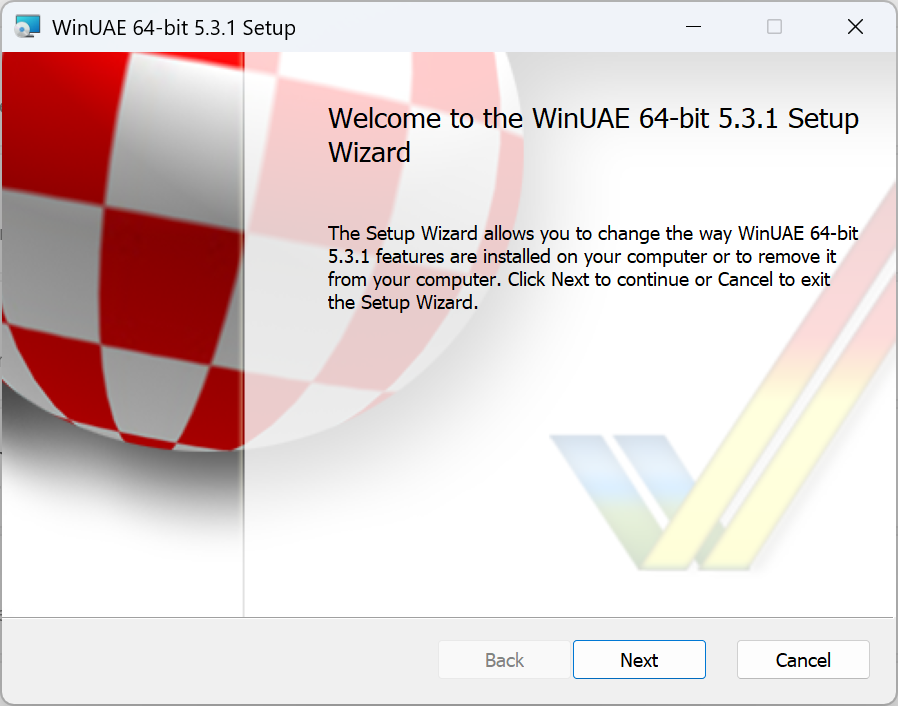
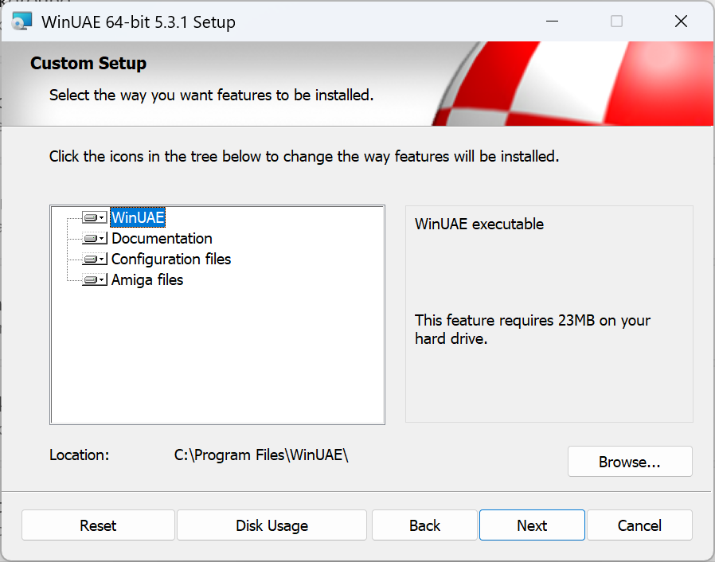

> ### Tip
>
> If you want to keep a portable version of WinUAE that doesn't require setup, it is recommended to use extract WinUAE in an appropriate location, such as `E:\Epyx`. All emulator files will be stored in this folder, so you can easily backup and transfer this to a new development environment.

Start the WinUAE emulator and the `WinUAE Properties` window should open at the `Quickstart` node of the `Settings` tree at the left.

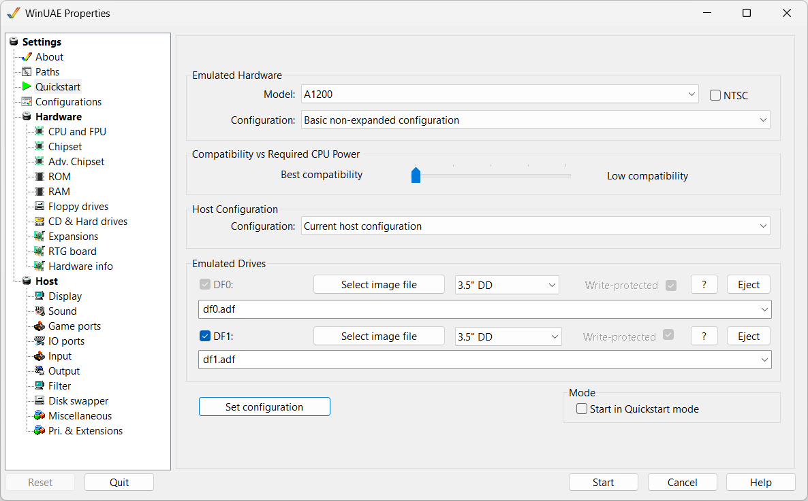

The Amiga 1200 is suitable for the Handy development software. Select it from the dropdown in the emulated hardware dropdown. Click on the `Set configuration` to apply the quickstart configuration as a starting point.

Next, create a new configuration for your Handy development environment, so it can be saved and loaded later or after a new installation. to store it for later use. by navigating to the `Configurations` item in the `Settings` tree.

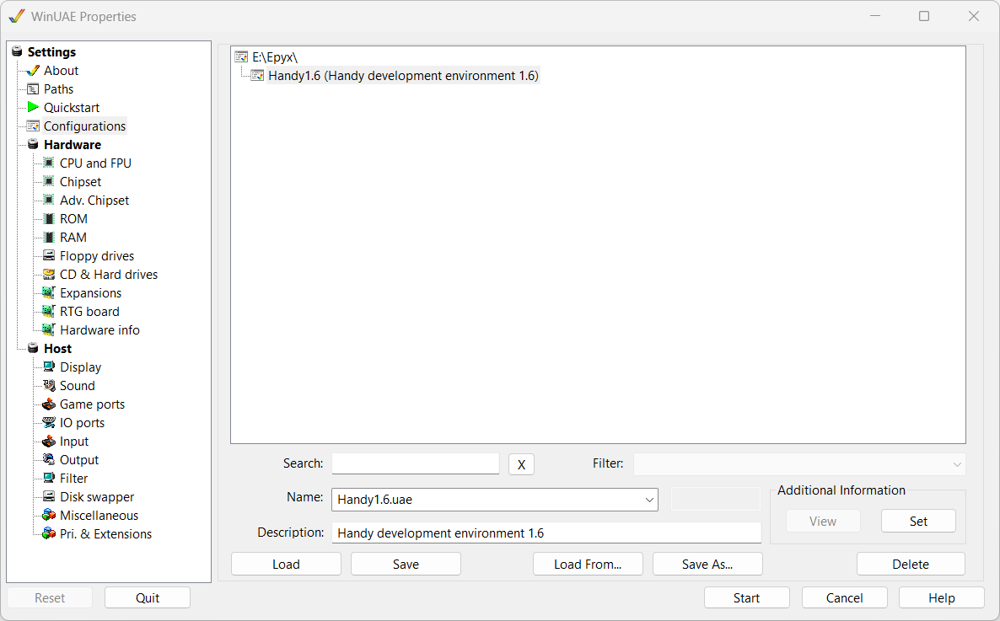

Enter the name `Handy1.6` for the configuration and add a description such as `Handy development environment 1.6`. Adjust the name and description to your needs. Click on the `Save` button to persist the configuration. It will be stored in a `.uae` file inside the same folder as where your emulator resides.

Switch to the `ROM` node inside the `Hardware` branch of the `Settings` tree.

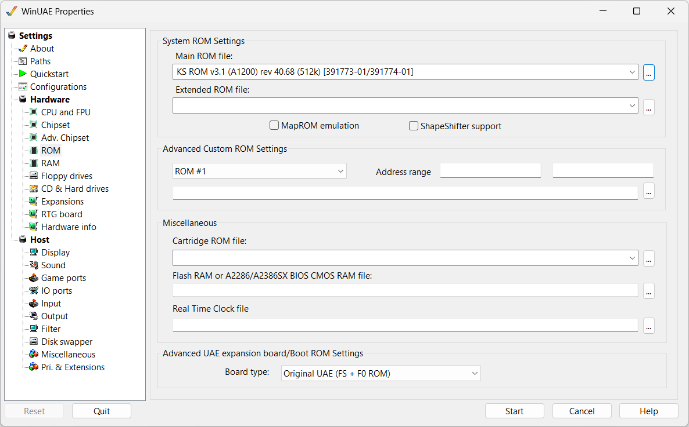

In the top section for `Systen ROM Settings` click on the elipsis (`...`) to the right of the `Main ROM file` setting. Locate the Kickstart 3.1 ROM file and select it. Save your configuration again from the `Configurations` node.

This configuration can be started in its current state and it will boot using Kickstart only.

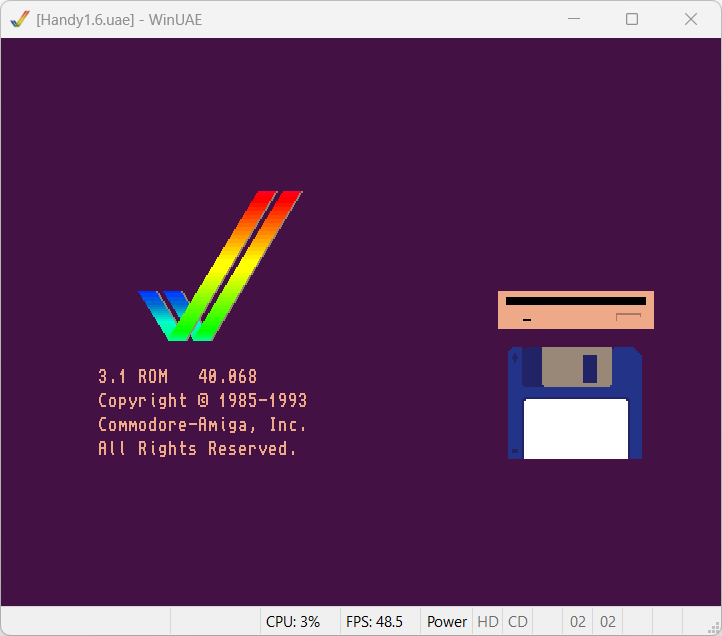

You might run into some errors at this point. If somehow you have selected a wrong quickstart configuration or ROM file combination, a prompt will appear at startup.

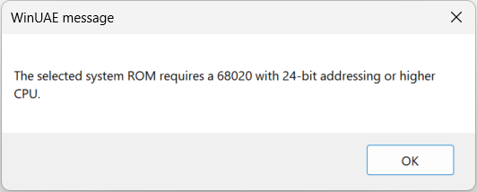

Another error might be that no ROM file was selected. In that case you get prompted that a ROM replacement will be used. 

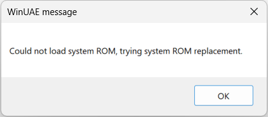

The Aros ROM will use an alternative OS for the Amiga that is free to use.

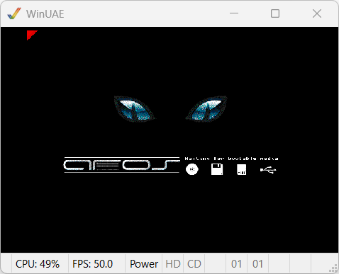

> Tip
>
> If you started WinUAE you can escape from the emulator window by pressing `Alt+Tab` or clicking the middle mouse button (if you have one).  
> Once the mouse is uncaptured you can click on `Power` in the status bar of `WinUAE` to open the `WinUAE Properties` window again.

The emulated Amiga 1200 can also boot by inserting a Workbench floppy disk. If you have the Workbench 3.11 `.adf` file, you can insert it as a diskette in floppy drive `df0:` by escaping from the emulator and clicking on the digit in the status bar to the right of the `CD` indication.

However, it is more convenient and faster to use a harddrive instead. Hard drives and directories are mounted from the `CD & Hard drives` node in the `Settings` tree. Navigate to it. 

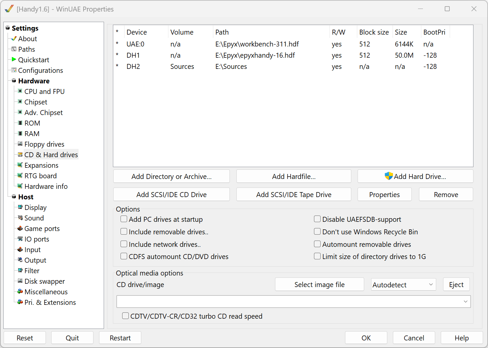

We will mount two disks and a folder from your machine:

1. Workbench 3.11 
   Click on `Add Hardfile` in the middle of the dialog.

   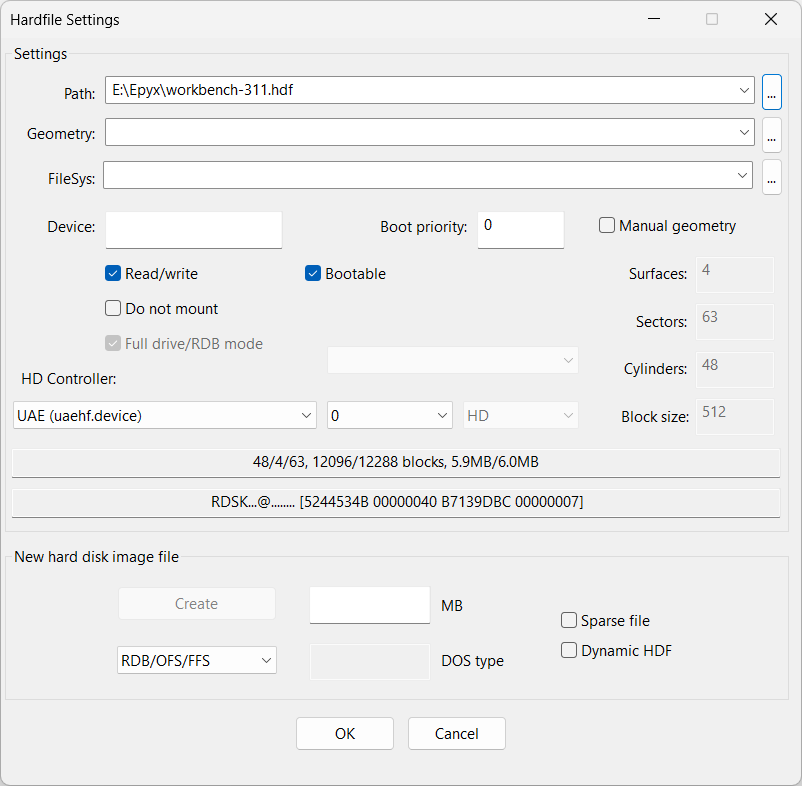

   Select the existing `Workbench-311.hdf` hardfile you can find in the Cloanto installation folder.
1. Custom harddisk for Handy development environment
   Open the `Hardfile Settings` dialog by clicking  `Add hardfile` again. Go to the section `New hard disk image file` at the bottom of the dialog. Enter `50 MB` as the size and click `Create` to the left of the size. Next, specify the name of the file as `epyxhandy-16.hdf` inside of your emulators folder.

1. Directory for your game files
   The last step will mount a folder from your development machine as a drive in WinUAE. This will probably be a folder that you have under source control at machine level, as it lives outside of the emulator. It is visible inside the emulator and all files can be accessed and manipulated from your development machine.

